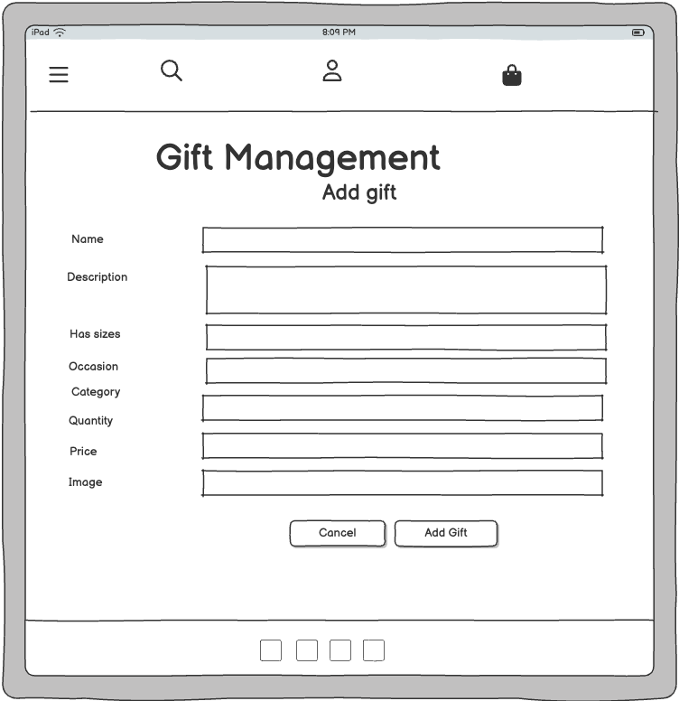

# [my-gifted-moments](https://my-gifted-moments-154948e92f6b.herokuapp.com)

source: [my-gifted-moments amiresponsive](https://ui.dev/amiresponsive?url=https://my-gifted-moments-154948e92f6b.herokuapp.com)

> [!IMPORTANT]
> The examples in these templates are strongly influenced by the Code Institute walkthrough project called "Boutique Ado".

## UX

### The 5 Planes of UX

#### 1. Strategy Plane
##### Purpose
- Deliver a delightful, stress-free shopping experience tailored for gifting needs.
- Make it simple for customers to customize gifts and add personal touches (e.g., notes, messages).
- Enable store admins to efficiently manage product availability, seasonal items, and orders.

##### Primary User Needs
- Shoppers (guests or registered): Need to explore gift categories, customize bundles, and checkout smoothly.
- Site Admins: Need tools to manage seasonal items, promotions, stock levels, and manage orders.

##### Business Goals
- Boost Sales by Creating a Seamless and Delightful Gifting Experience.
- Foster Customer Loyalty Through Personalization and Smart Account Features.
- Ensure a Curated, Well-Maintained Gift Collection.

#### 2. Scope Plane
##### Features
- A full list of [Features](#features) can be viewed in detail below.

##### Content Requirements
- Gift details, including name, price, description, category, and images.
- Clear prompts and instructions for browsing, filtering, and purchasing.
- Order details, confirmation pages, and email notifications.
- Secure payment processing using Stripe.
- Payment success emails sent to users.
- Favorite list contains the gifts which user marked as Favorite.
- Profile contains default delivery information which may be modified by user and order history.
- FAQ page contains frequntely asked question and answers to them.
- Contact Us page contains the form which user might send directly to admin.
- Newsletter contains the form to activate a subscription for sending mails to him. 
- 404 page for lost users.

#### 3. Structure Plane
##### Information Architecture
- **Navigation Menu**:
  - Links to Home, Gifts, Cart, FAQ, Contact Us, Newsletter and Account sections.
- **Hierarchy**:
  - Prominent gift categories and filters for easy navigation.
  - Cart and checkout options displayed prominently for convenience.
  - Favorite List and Gift Management options displayed under account section

##### User Flow
1. Guest user browses the store → filters and sorts products by category, occasion, price, or name.
2. Guest user adds items to the cart → proceeds to checkout.
3. Guest user creates an account or logs in during checkout → completes purchase.
4. Guest user can browse FAQ page → see frequently asked questions and expand answers.
5. Guest user can browse Contact us page → can fill the form, submit it and receive suceess message.
6. Returning customers log in → view past orders and track purchase history.
7. Registred users add items to favorite list → view favorite list, add to favorite list and remove from favorite list.
8. Site owners manage inventory → add, update, or delete products and categories.
9. Site owners manage orders → add, change and see orders.
10. Site owners manage FAQs → can add a new question, edit and delete it.
11. Site owners manage Contact Us submited forms → receive a mail who jas submitted the form and filled infromation.
12. Site owners browse subscription → browse, add and delete users who has subsribed to newsletter.
13. Users signup to the newsletter → potentially receive advanced notice of upcoming sales.
14. User get error 404 → when user goes to the path which doesn't exist - he gets the 404 error.

#### 4. Skeleton Plane
##### Wireframe Suggestions
- A full list of [Wireframes](#wireframes) can be viewed in detail below.

#### 5. Surface Plane
##### Visual Design Elements
- **[Colours](#colour-scheme)**: see below.
- **[Typography](#typography)**: see below.

### Colour Scheme

I used [coolors.co](https://coolors.co/080708-3772ff-df2935-fdca40-e6e8e6) to generate my color palette.

- `#333` primary text.
- `#ffffff` primary highlights.
- `#555` secondary text.
- `#555` secondary highlights.

### Typography

- [Playfair Display](https://fonts.google.com/specimen/PlayfairDisplay) was used for the primary headers and titles.
- [Lato](https://fonts.google.com/specimen/Lato) was used for all other secondary text.
- [Imperial Script](https://fonts.google.com/specimen/ImperialScript) was used for word Moment on home banner.
- [Font Awesome](https://fontawesome.com) icons were used throughout the site, such as the social media icons in the footer.

## User Stories

| Target | Expectation | Outcome |
| --- | --- | --- |
| As a guest user | I would like to browse gifts without needing to register | so that I can shop freely before deciding to create an account. |
| As a guest user | I would like to be prompted to create an account or log in at checkout | so that I can complete my purchase and track my order history. |
| As a guest user | I would like to browse FAQ page | so that I can find an answer to my question and get know more about store. |
| As a guest user | I would like to browse Contact Us page | so that I can fill the form and submit in case if I have a question or I want to be contacted by the store employee regarding my query. |
| As a user | I would like to sign up to the site's newsletter | so that I can stay up to date with any upcoming sales or promotions. |
| As a customer | I would like to browse various gift categories | so that I can easily find what I'm looking for. |
| As a customer | I would like to sort gifts by price (low-to-high/high-to-low) and name (alphabetical) | so that I can quickly organize items in a way that suits my shopping style. |
| As a customer | I would like to filter gifts by category | so that I can narrow down the gifts to the types I am most interested in. |
| As a customer | I would like to filter gifts by occasion | so that I can narrow down the gifts to the occasions I am most interested in. |
| As a customer | I would like to click on individual gifts to view more details (description, price, image, etc.) | so that I can make an informed decision about my purchase. |
| As a customer | I would like to add items to favorite list | so that I can make back to them if I would like to purchase them later. |
| As a customer | I would like to add items to my shopping cart using quantity increment/decrement buttons | so that I can adjust how many units of a product I want before checkout. |
| As a customer | I would like to view and manage my shopping cart | so that I can review, add, or remove items before proceeding to checkout. |
| As a customer | I would like to adjust the quantity of items in my cart | so that I can modify my purchase preferences without leaving the cart. |
| As a customer | I would like to remove items from my cart | so that I can remove gifts I no longer wish to buy. |
| As a customer | I would like to proceed to checkout where I see my cart items, grand total, and input my name, email, shipping address, and card details | so that I can complete my purchase. |
| As a customer | I would like to receive a confirmation email after my purchase | so that I can have a record of my transaction and order details. |
| As a customer | I would like to see an order confirmation page with a checkout order number after completing my purchase | so that I know my order has been successfully placed. |
| As a customer | I would like to securely enter my card details using Stripe at checkout | so that I can feel confident my payment information is protected. |
| As a returning customer | I would like to be able to log in and view my past orders | so that I can track my previous purchases and order history. |
| As a returning customer | I would like the checkout process to remember my shipping address | so that future purchases are quicker and easier. |
| As a site owner | I would like to create new products with a name, description, price, images, and category | so that I can add additional items to the store inventory. |
| As a site owner | I would like to update product details (name, price, description, image, category) at any time | so that I can keep my product listings accurate and up to date. |
| As a site owner | I would like to delete products that are no longer available or relevant | so that I can maintain a clean and accurate inventory. |
| As a site owner | I would like to view all orders placed on the website | so that I can track and manage customer purchases. |
| As a site owner | I would like to manage product categories | so that I can ensure items are correctly organized and easy for customers to find. |
| As a site owner | I would like to manage product occasions | so that I can add more ocassions at the time of celebration of big events such as Christmas, Easter etc. |
| As a site owner | I would like to manage frequntle asked questions| so that I can keep questions are updated and add new questions which customers ask often
| As a site owner | I would like to manage contact forms and receive them on my email | so that I can see which person want to be contacted and what's his question, it would decrease waiting time and allow me to reply as soon as possible  |
| As a user | I would like to see a 404 error page if I get lost | so that it's obvious that I've stumbled upon a page that doesn't exist. |

## Wireframes

To follow best practice, wireframes were developed for mobile, tablet, and desktop sizes.
I've used [Balsamiq](https://balsamiq.com/wireframes) to design my site wireframes.

| Page | Mobile | Tablet | Desktop |
| --- | --- | --- | --- |
| Register |  |  |  |
| Login |  |  |  |
| Logout |  |  |  |
| Profile |  |  |  |
| Home |  |  |  |
| Gifts |  |  |  |
| Gift Details |  |  |  |
| Bag |  |  |  |
| Checkout |  |  |  |
| Checkout Success |  |  |  |
| My favorite list |  |  |  |
| Add Gift |  |  |  |
| Edit Gift|  |  |  |
| Newsletter |  |  |  |
| Contact |  |  |  |
| FAQ |  |  |  |
| 404 |  |  |  |

