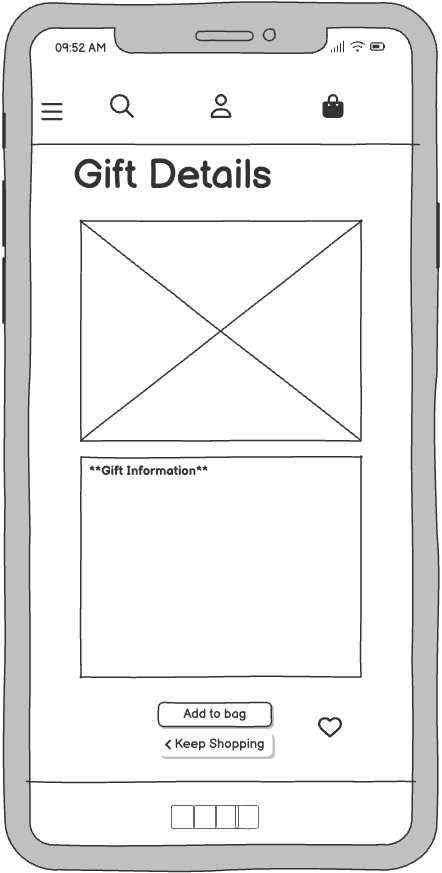
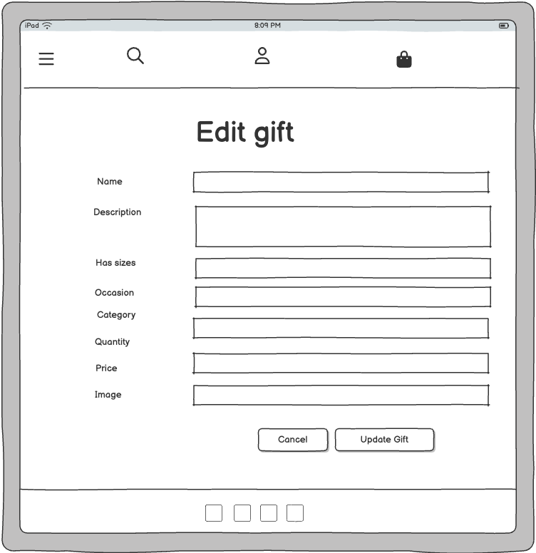
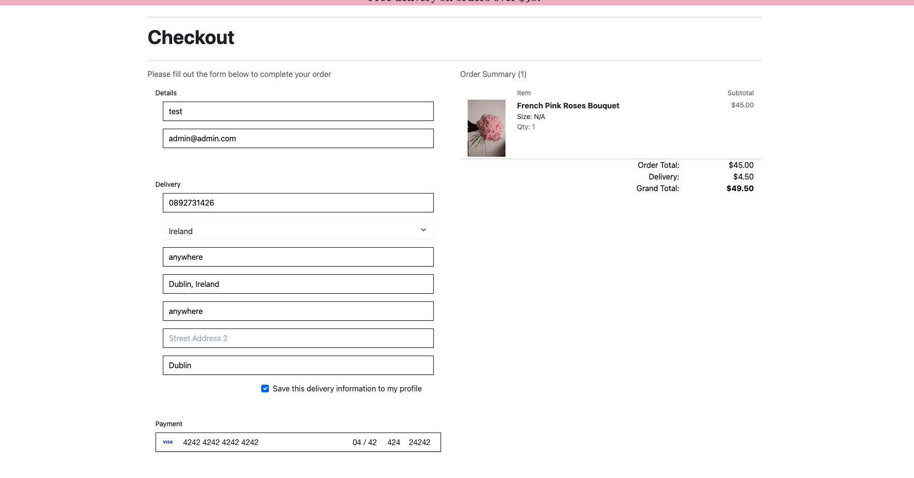

# [my-gifted-moments](https://my-gifted-moments-154948e92f6b.herokuapp.com)

[](https://www.github.com/dfedyachkina/my-gifted-moments/commits/main)
[](https://www.github.com/dfedyachkina/my-gifted-moments/commits/main)
[](https://www.github.com/dfedyachkina/my-gifted-moments)


source: [my-gifted-moments amiresponsive](https://ui.dev/amiresponsive?url=https://my-gifted-moments-154948e92f6b.herokuapp.com)

> [!IMPORTANT]
> The examples in these templates are strongly influenced by the Code Institute walkthrough project called "Boutique Ado".

## UX

### The 5 Planes of UX

#### 1. Strategy Plane
##### Purpose
- Deliver a delightful, stress-free shopping experience tailored for gifting needs.
- Make it simple for customers to customize gifts and add personal touches (e.g., notes, messages).
- Enable store admins to efficiently manage product availability, seasonal items, and orders.

##### Primary User Needs
- Shoppers (guests or registered): Need to explore gift categories, customize bundles, and checkout smoothly.
- Site Admins: Need tools to manage seasonal items, promotions, stock levels, and manage orders.

##### Business Goals
- Boost Sales by Creating a Seamless and Delightful Gifting Experience.
- Foster Customer Loyalty Through Personalization and Smart Account Features.
- Ensure a Curated, Well-Maintained Gift Collection.

#### 2. Scope Plane
##### Features
- A full list of [Features](#features) can be viewed in detail below.

##### Content Requirements
- Gift details, including name, price, description, category, and images.
- Clear prompts and instructions for browsing, filtering, and purchasing.
- Order details, confirmation pages, and email notifications.
- Secure payment processing using Stripe.
- Payment success emails sent to users.
- Favorite list contains the gifts which user marked as Favorite.
- Profile contains default delivery information which may be modified by user and order history.
- FAQ page contains frequntely asked question and answers to them.
- Contact Us page contains the form which user might send directly to admin.
- Newsletter contains the form to activate a subscription for sending mails to him. 
- 404 page for lost users.

#### 3. Structure Plane
##### Information Architecture
- **Navigation Menu**:
  - Links to Home, Gifts, Cart, FAQ, Contact Us, Newsletter and Account sections.
- **Hierarchy**:
  - Prominent gift categories and filters for easy navigation.
  - Cart and checkout options displayed prominently for convenience.
  - Favorite List and Gift Management options displayed under account section

##### User Flow
1. Guest user browses the store → filters and sorts products by category, occasion, price, or name.
2. Guest user adds items to the cart → proceeds to checkout.
3. Guest user creates an account or logs in during checkout → completes purchase.
4. Guest user can browse FAQ page → see frequently asked questions and expand answers.
5. Guest user can browse Contact us page → can fill the form, submit it and receive suceess message.
6. Returning customers log in → view past orders and track purchase history.
7. Registred users add items to favorite list → view favorite list, add to favorite list and remove from favorite list.
8. Site owners manage inventory → add, update, or delete products and categories.
9. Site owners manage orders → add, change and see orders.
10. Site owners manage FAQs → can add a new question, edit and delete it.
11. Site owners manage Contact Us submited forms → receive a mail who jas submitted the form and filled infromation.
12. Site owners browse subscription → browse, add and delete users who has subsribed to newsletter.
13. Users signup to the newsletter → potentially receive advanced notice of upcoming sales.
14. User get error 404 → when user goes to the path which doesn't exist - he gets the 404 error.

#### 4. Skeleton Plane
##### Wireframe Suggestions
- A full list of [Wireframes](#wireframes) can be viewed in detail below.

#### 5. Surface Plane
##### Visual Design Elements
- **[Colours](#colour-scheme)**: see below.
- **[Typography](#typography)**: see below.

### Colour Scheme

I used [coolors.co](https://coolors.co/080708-3772ff-df2935-fdca40-e6e8e6) to generate my color palette.

- `#333` primary text.
- `#ffffff` primary highlights.
- `#555` secondary text.
- `#555` secondary highlights.


### Typography


- [Playfair Display](https://fonts.google.com/specimen/PlayfairDisplay) was used for the primary headers and titles.
- [Lato](https://fonts.google.com/specimen/Lato) was used for all other secondary text.
- [Imperial Script](https://fonts.google.com/specimen/ImperialScript) was used for word Moment on home banner.
- [Font Awesome](https://fontawesome.com) icons were used throughout the site, such as the social media icons in the footer.

## User Stories

| Target | Expectation | Outcome |
| --- | --- | --- |
| As a guest user | I would like to browse gifts without needing to register | so that I can shop freely before deciding to create an account. |
| As a guest user | I would like to be prompted to create an account or log in at checkout | so that I can complete my purchase and track my order history. |
| As a guest user | I would like to browse FAQ page | so that I can find an answer to my question and get know more about store. |
| As a guest user | I would like to browse Contact Us page | so that I can fill the form and submit in case if I have a question or I want to be contacted by the store employee regarding my query. |
| As a user | I would like to sign up to the site's newsletter | so that I can stay up to date with any upcoming sales or promotions. |
| As a customer | I would like to browse various gift categories | so that I can easily find what I'm looking for. |
| As a customer | I would like to sort gifts by price (low-to-high/high-to-low) and name (alphabetical) | so that I can quickly organize items in a way that suits my shopping style. |
| As a customer | I would like to filter gifts by category | so that I can narrow down the gifts to the types I am most interested in. |
| As a customer | I would like to filter gifts by occasion | so that I can narrow down the gifts to the occasions I am most interested in. |
| As a customer | I would like to click on individual gifts to view more details (description, price, image, etc.) | so that I can make an informed decision about my purchase. |
| As a customer | I would like to add items to favorite list | so that I can make back to them if I would like to purchase them later. |
| As a customer | I would like to add items to my shopping cart using quantity increment/decrement buttons | so that I can adjust how many units of a product I want before checkout. |
| As a customer | I would like to view and manage my shopping cart | so that I can review, add, or remove items before proceeding to checkout. |
| As a customer | I would like to adjust the quantity of items in my cart | so that I can modify my purchase preferences without leaving the cart. |
| As a customer | I would like to remove items from my cart | so that I can remove gifts I no longer wish to buy. |
| As a customer | I would like to proceed to checkout where I see my cart items, grand total, and input my name, email, shipping address, and card details | so that I can complete my purchase. |
| As a customer | I would like to receive a confirmation email after my purchase | so that I can have a record of my transaction and order details. |
| As a customer | I would like to see an order confirmation page with a checkout order number after completing my purchase | so that I know my order has been successfully placed. |
| As a customer | I would like to securely enter my card details using Stripe at checkout | so that I can feel confident my payment information is protected. |
| As a returning customer | I would like to be able to log in and view my past orders | so that I can track my previous purchases and order history. |
| As a returning customer | I would like the checkout process to remember my shipping address | so that future purchases are quicker and easier. |
| As a site owner | I would like to create new products with a name, description, price, images, and category | so that I can add additional items to the store inventory. |
| As a site owner | I would like to update product details (name, price, description, image, category) at any time | so that I can keep my product listings accurate and up to date. |
| As a site owner | I would like to delete products that are no longer available or relevant | so that I can maintain a clean and accurate inventory. |
| As a site owner | I would like to view all orders placed on the website | so that I can track and manage customer purchases. |
| As a site owner | I would like to manage product categories | so that I can ensure items are correctly organized and easy for customers to find. |
| As a site owner | I would like to manage product occasions | so that I can add more ocassions at the time of celebration of big events such as Christmas, Easter etc. |
| As a site owner | I would like to manage frequntle asked questions| so that I can keep questions are updated and add new questions which customers ask often
| As a site owner | I would like to manage contact forms and receive them on my email | so that I can see which person want to be contacted and what's his question, it would decrease waiting time and allow me to reply as soon as possible  |
| As a user | I would like to see a 404 error page if I get lost | so that it's obvious that I've stumbled upon a page that doesn't exist. |

## Wireframes

To follow best practice, wireframes were developed for mobile, tablet, and desktop sizes.
I've used [Balsamiq](https://balsamiq.com/wireframes) to design my site wireframes.

| Page | Mobile | Tablet | Desktop |
| --- | --- | --- | --- |
| Register |  |  |  |
| Login |  |  |  |
| Logout |  |  |  |
| Profile |  |  |  |
| Home |  |  |  |
| Gifts |  |  |  |
| Gift Details |  |  |  |
| Bag |  |  |  |
| Checkout |  |  |  |
| Checkout Success |  |  |  |
| My favorite list |  |  |  |
| Add Gift |  |  |  |
| Edit Gift|  |  |  |
| Newsletter |  |  |  |
| Contact |  |  |  |
| FAQ |  |  |  |
| 404 |  |  |  |

## Features

### Existing Features

| Feature | Notes | Screenshot |
| --- | --- | --- |
| Register | Authentication is handled by allauth, allowing users to register accounts. |  |
| Login | Authentication is handled by allauth, allowing users to log in to their existing accounts. |  |
| Logout | Authentication is handled by allauth, allowing users to log out of their accounts. |  |
| Home | Home page shows a banner and link to shop. |  |
| Gift List | Users can browse all available products with sorting, filtering by categories, and search functionality. |  |
| Gift Details | Displays detailed information about a selected product, including its name, description, price, an image, and available sizes. |  |
| Add to Bag | Users can add items to their shopping bag, with support for selecting different sizes if applicable. |  |
| View Bag | Users can view the contents of their shopping bag, adjust quantities, or remove items. |  |
| Checkout | Users can proceed to checkout, where they provide their delivery details and payment information using Stripe integration. |  |
| Order Confirmation | Users receive an on-screen and email confirmation with details of their purchase. |  |
| Profile Management | Users can manage their profile information, including their default delivery address and order history. |  |
| Order History | Users can view their past orders and access details of each order, including products purchased and the delivery status. |  |
| Add to favorite list | Users can add liked items to favorite list. |  |
| Favorite List | Users can browse items which he added to favorite list. |  |
| Gift Management | Superusers can add, edit, and delete products from the site via a CRUD interface. |  |
| Newsletter | Users can register their email address to receive newsletters from the site. Currently, this only stores the email in the database. |  |
| Contact | Users can submit a message via the contact form, which stores their name, email, and message in the database. |  |
| FAQs | Admins can manage frequently asked questions, which are displayed on the site for users. |  |
| Heroku Deployment | The site is deployed to Heroku, making it accessible online for users. |  |
| SEO | SEO optimization with a sitemap.xml, robots.txt, and appropriate meta tags to improve search engine visibility. |  |
| Marketing | Social media presence is available in the footer using external links, as well as a Facebook Marketplace wireframe in the README for future integrations. |  |
| 404 | The 404 error page will indicate when a user has navigated to a page that doesn't exist, replacing the default Heroku 404 page with one that ties into the site's look and feel. |  |

### Future Features

- **Guft Reviews & Ratings**: Allow customers to leave reviews and rate products, with admin moderation. Display average ratings and review counts on product pages.
- **Discount Codes and Vouchers**: Allow the admin to create discount codes or vouchers for promotions and marketing campaigns.
- **Loyalty Program**: Introduce a points-based loyalty system where customers earn points for purchases, which can be redeemed for discounts.
- **Multi-Currency and Multi-Language Support**: Expand the application to support multiple currencies and languages to reach a global audience.
- **Product Bundles**: Offer discounted product bundles (e.g., buy 3 for the price of 2) or custom product kits.
- **Social Media Integration**: Enable users to share products directly to social media platforms or implement a social login for quick account creation.
- **Shipping Tracking Integration**: Provide real-time shipping updates and tracking information directly within the user’s order history.
- **Advanced Analytics Dashboard for Admin**: Offer an in-depth dashboard that displays sales trends, popular products, customer behavior, and more.
- **Mobile App**: Develop a mobile app for iOS and Android, providing users with a more optimized shopping experience on mobile devices.

## Tools & Technologies

| Tool / Tech | Use |
| --- | --- |
| [](https://markdown.2bn.dev) | Generate README and TESTING templates. |
| [](https://git-scm.com) | Version control. (`git add`, `git commit`, `git push`) |
| [](https://github.com) | Secure online code storage. |
| [](https://gitpod.io) | Cloud-based IDE for development. |
| [](https://code.visualstudio.com) | Local IDE for development. |
| [](https://en.wikipedia.org/wiki/HTML) | Main site content and layout. |
| [](https://en.wikipedia.org/wiki/CSS) | Design and layout. |
| [](https://www.javascript.com) | User interaction on the site. |
| [](https://jquery.com) | User interaction on the site. |
| [](https://www.python.org) | Back-end programming language. |
| [](https://www.heroku.com) | Hosting the deployed back-end site. |
| [](https://getbootstrap.com) | Front-end CSS framework for modern responsiveness and pre-built components. |
| [](https://www.djangoproject.com) | Python framework for the site. |
| [](https://www.postgresql.org) | Relational database management. |
| [](https://cloudinary.com) | Online static file storage. |
| [](https://whitenoise.readthedocs.io) | Serving static files with Heroku. |
| [](https://stripe.com) | Online secure payments of e-commerce products/services. |
| [](https://mail.google.com) | Sending emails in my application. |
| [](https://www.canva.com/p/canvawireframes) | Creating favicon and logo |
| [](https://fontawesome.com) | Icons. |
| [](https://chat.openai.com) | Help debug, troubleshoot, and explain things. |
| [](https://mermaid.live) | Generate an interactive diagram for the data/schema. |


## Database Design

### Data Model

Entity Relationship Diagrams (ERD) help to visualize database architecture before creating models. Understanding the relationships between different tables can save time later in the project.


I have used `Mermaid` to generate an interactive ERD of my project.


source: [Mermaid](https://mermaid.live/edit#pako:eNqVVcFu2zAM_RVD57RIHLdpfRs6DBg2bB2GXYYAhmIxjlBZcimqqdvk3yfbSVPHceP5kBh8TyRFPtKvLDUCWMwAP0ueIc_nOvDPHwsYvDbv1SM1BVIE998OpieO6Ypj4DxV8xy6CORcqq654NauDYoG2c71IeQ9mqVUMDCygCV3ipJiZTQk2uULwH6WJQSghAuBYO1kKDHsJ5JZ68Rgkkoq-1mpcfojvDCWqiac8YDliXoFm83FxWbTql0crLhNfEX2xDtOkBksB1b1dC-XKEELVSYH-C0TH1m4lAb6tw_uXFCCZ_K3tynKgqTRB2RhjKrvZ-UL2INdQCpzroICZQpdM3KSOuuG9WAGicN3Kq1NzW_PNauam82hrHGwAGV0Zr0g9tyfKAYPkKm4vfJdOqWS_5uvD8ehJabWsV4dfqzzs3N1dp6OJ0T4ypLMoX7pNlOAkk-ApZ8LS124KScZ4qoL-g2nxTFYy82gzKTmKlnw7OQdZAFJIY-3Vt3o71LDV4L8TMMr06Pjmlp13KemvBPpnRxn99afRn618k8lsddlO6NmG-Rcl6fy3R3ZK7tfyTtie890yT9gbRUQDdb-Owm_3ebOaOKD18mg0ag7nHv1daf6y6dfAyM9OrDtbVS75dqu94O2ZSOWA_rgwn9Ta7dzRivwKbLYvwqOD3M21xWPOzK_S52ymNDBiLmikvvuK8ziJVfWWwuuWfzKnlk8jSaXN9ez8HoyHc_C8TiajVjJ4ovp5XUUTqMovLqdXd2Et-FsO2Ivxngfk8vxZBpGkT_m_zxW-_tbY01QNC5b7YJt_wE0ZoQj)


I have used `pygraphviz` and `django-extensions` to auto-generate an ERD.

The steps taken were as follows:
- In the terminal: `sudo apt update`
- then: `sudo apt-get install python3-dev graphviz libgraphviz-dev pkg-config`
- then type `Y` to proceed
- then: `pip3 install django-extensions pygraphviz`
- in my `settings.py` file, I added the following to my `INSTALLED_APPS`:
```python
INSTALLED_APPS = [
    ...
    'django_extensions',
    ...
]
```
- back in the terminal: `python3 manage.py graph_models -a -o erd.png`
- drag the new `erd.png` file into my `documentation/` folder
- removed `'django_extensions',` from my `INSTALLED_APPS`
- finally, in the terminal: `pip3 uninstall django-extensions pygraphviz -y`


source: [medium.com](https://medium.com/@yathomasi1/1-using-django-extensions-to-visualize-the-database-diagram-in-django-application-c5fa7e710e16)

## Agile Development Process

### GitHub Projects

[GitHub Projects](https://www.github.com/dfedyachkina/my-gifted-moments/projects) served as an Agile tool for this project. Through it, EPICs, User Stories, issues/bugs, and Milestone tasks were planned, then subsequently tracked on a regular basis using the Kanban project board.


### GitHub Issues

[GitHub Issues](https://www.github.com/dfedyachkina/my-gifted-moments/issues) served as an another Agile tool. There, I managed my User Stories and Milestone tasks, and tracked any issues/bugs.

| Link | Screenshot |
| --- | --- |
| [](https://www.github.com/dfedyachkina/my-gifted-moments/issues) |  |
| [](https://www.github.com/dfedyachkina/my-gifted-moments/issues?q=is%3Aissue+is%3Aclosed) |  |

### MoSCoW Prioritization

I've decomposed my Epics into User Stories for prioritizing and implementing them. Using this approach, I was able to apply "MoSCoW" prioritization and labels to my User Stories within the Issues tab.

- **Must Have**: guaranteed to be delivered - required to Pass the project (*max ~60% of stories*)
- **Should Have**: adds significant value, but not vital (*~20% of stories*)
- **Could Have**: has small impact if left out (*the rest ~20% of stories*)
- **Won't Have**: not a priority for this iteration - future features

## Ecommerce Business Model

Gifted Moments operates on a **Business to Customer (B2C) model**, catering directly to individual customers seeking thoughtful and unique gifts. It follows a straightforward B2C approach—focused on one-time purchases rather than subscriptions—making it easy for customers to find and buy the perfect gift without any long-term commitments.

Although still in the early stages of development, Gifted Moments already features a growing newsletter list and active links to its social media channels, laying the foundation for strong customer engagement.

Social media plays a key role in building a supportive and enthusiastic community around the brand. Platforms like Facebook and Instagram can help increase visibility, connect with loyal customers, and attract new visitors to the site through engaging content and promotions.

The newsletter allows Gifted Moments to stay in touch with its audience by sharing updates on new arrivals, exclusive offers, seasonal specials, store announcements, and upcoming events—keeping customers informed and connected.

