# Testing

> [!NOTE]
> Return back to the [README.md](README.md) file.

## Code Validation

### HTML

I have used the recommended [HTML W3C Validator](https://validator.w3.org) to validate all of my HTML files.

| Directory | File | URL | Screenshot | Notes |
| --- | --- | --- | --- | --- |
| bag | [bag.html](https://github.com/dfedyachkina/my-gifted-moments/blob/main/bag/templates/bag/bag.html) | https://validator.w3.org/nu/?doc=https%3A%2F%2Fmy-gifted-moments-154948e92f6b.herokuapp.com%2Fbag%2F |  | Notes (if applicable) |
| checkout | [checkout.html](https://github.com/dfedyachkina/my-gifted-moments/blob/main/checkout/templates/checkout/checkout.html) | https://validator.w3.org/nu/?doc=https%3A%2F%2Fmy-gifted-moments-154948e92f6b.herokuapp.com%2Fcheckout | 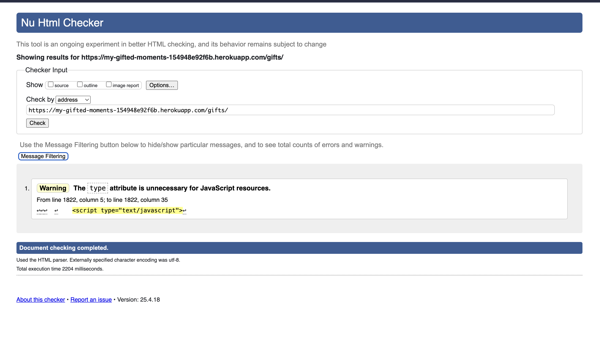 | Notes (if applicable) |
| checkout | [checkout_success.html](https://github.com/dfedyachkina/my-gifted-moments/blob/main/checkout/templates/checkout/checkout_success.html) | Link (if applicable) | 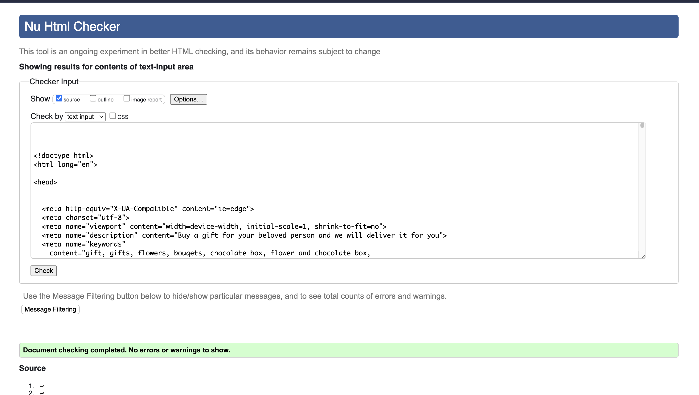 | Notes (if applicable) |
| contact | [contact.html](https://github.com/dfedyachkina/my-gifted-moments/blob/main/contact/templates/contact/contact.html) | https://validator.w3.org/nu/?doc=https%3A%2F%2Fmy-gifted-moments-154948e92f6b.herokuapp.com%2Fcontact | 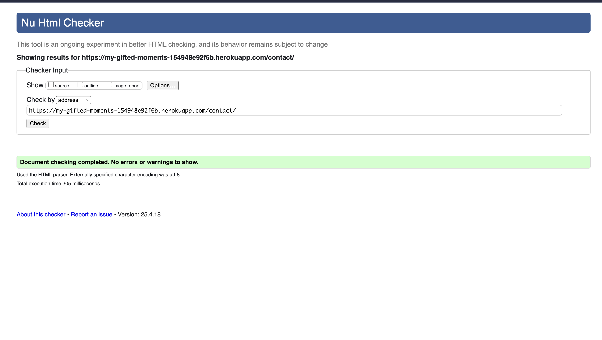 | Notes (if applicable) |
| faq | [faq_list.html](https://github.com/dfedyachkina/my-gifted-moments/blob/main/faq/templates/faq/faq_list.html) | https://validator.w3.org/nu/?doc=https%3A%2F%2Fmy-gifted-moments-154948e92f6b.herokuapp.com%2Ffaq|  | Notes (if applicable) |
| favorites | [favorite_list.html](https://github.com/dfedyachkina/my-gifted-moments/blob/main/favorites/templates/favorites/favorite_list.html) | Link (if applicable) |  | Notes (if applicable) |
| gifts | [add_gift.html](https://github.com/dfedyachkina/my-gifted-moments/blob/main/gifts/templates/gifts/add_gift.html) | Link (if applicable) | 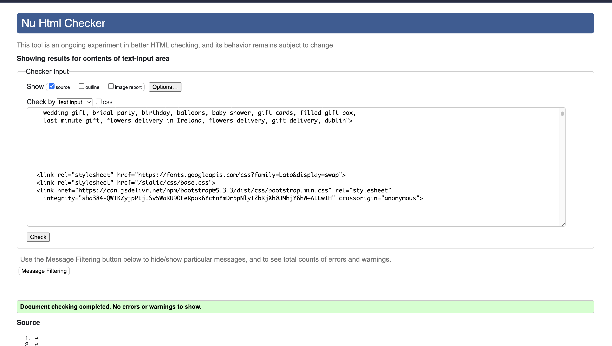 | Notes (if applicable) |
| gifts | [edit_gift.html](https://github.com/dfedyachkina/my-gifted-moments/blob/main/gifts/templates/gifts/edit_gift.html) | Link (if applicable) | 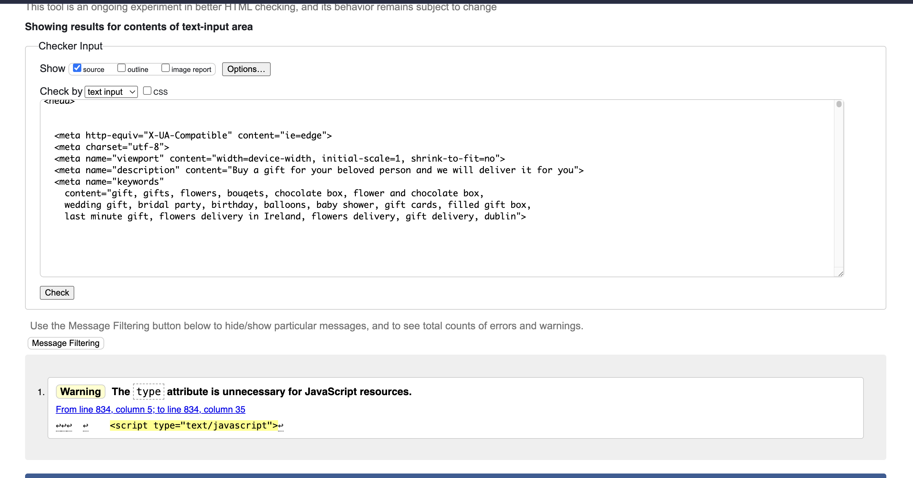 | Notes (if applicable) |
| gifts | [gift_detail.html](https://github.com/dfedyachkina/my-gifted-moments/blob/main/gifts/templates/gifts/gift_detail.html) | https://validator.w3.org/nu/?doc=https%3A%2F%2Fmy-gifted-moments-154948e92f6b.herokuapp.com%2Fgifts%2Fgift%2F1 | 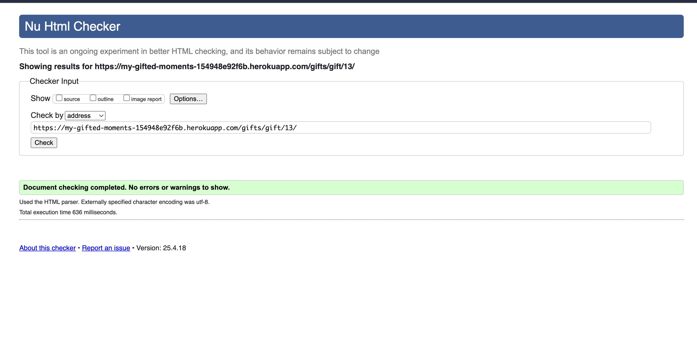 | Notes (if applicable) |
| gifts | [gift_list.html](https://github.com/dfedyachkina/my-gifted-moments/blob/main/gifts/templates/gifts/gift_list.html) | https://validator.w3.org/nu/?doc=https%3A%2F%2Fmy-gifted-moments-154948e92f6b.herokuapp.com%2Fgifts| 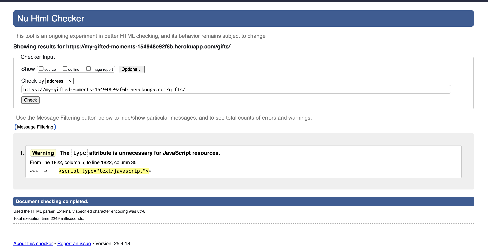 | Notes (if applicable) |
| home | [index.html](https://github.com/dfedyachkina/my-gifted-moments/blob/main/home/templates/home/index.html) | https://validator.w3.org/nu/?doc=https%3A%2F%2Fmy-gifted-moments-154948e92f6b.herokuapp.com%2F | 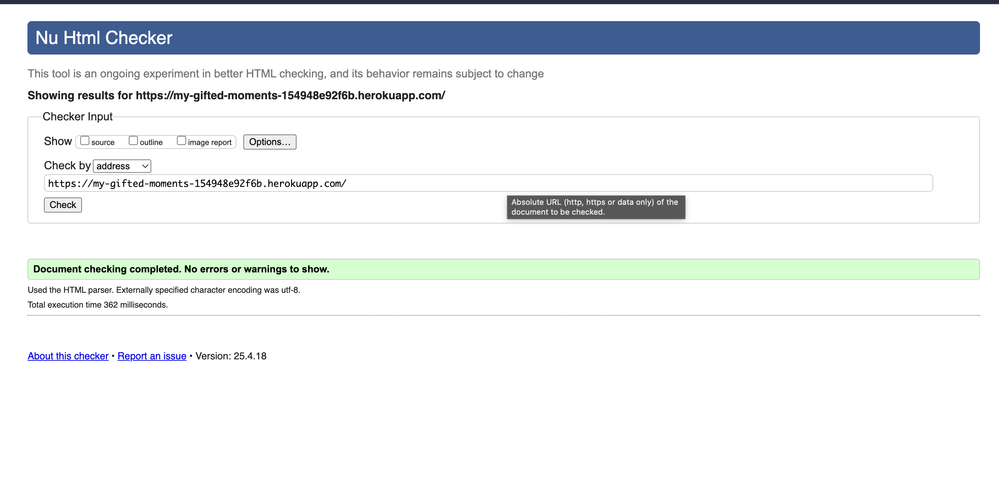 | Notes (if applicable) |
| profiles | [profile.html](https://github.com/dfedyachkina/my-gifted-moments/blob/main/profiles/templates/profiles/profile.html) | Link (if applicable) |  | Notes (if applicable) |
| templates | [404.html](https://github.com/dfedyachkina/my-gifted-moments/blob/main/templates/errors/404.html) | Link (if applicable) |  | Notes (if applicable) |

### CSS

I have used the recommended [CSS Jigsaw Validator](https://jigsaw.w3.org/css-validator) to validate all of my CSS files.

| Directory | File | URL | Screenshot | Notes |
| --- | --- | --- | --- | --- |
| checkout | [checkout.css](https://github.com/dfedyachkina/my-gifted-moments/blob/main/checkout/static/checkout/css/checkout.css) | Link (if applicable) | 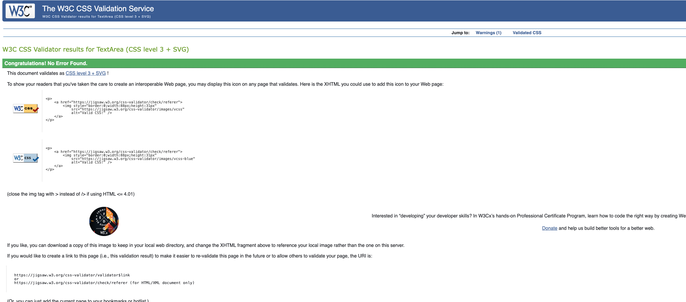 | Notes (if applicable) |
| profiles | [profile.css](https://github.com/dfedyachkina/my-gifted-moments/blob/main/profiles/static/profiles/css/profile.css) | Link (if applicable) | 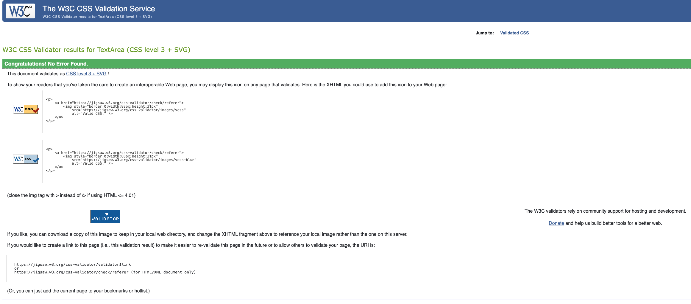 | Notes (if applicable) |
| static | [base.css](https://github.com/dfedyachkina/my-gifted-moments/blob/main/static/css/base.css) | https://jigsaw.w3.org/css-validator/validator?uri=https://my-gifted-moments-154948e92f6b.herokuapp.com | 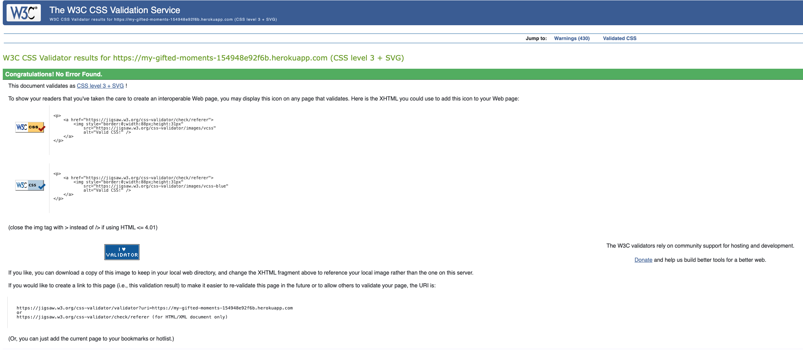 | Notes (if applicable) |

