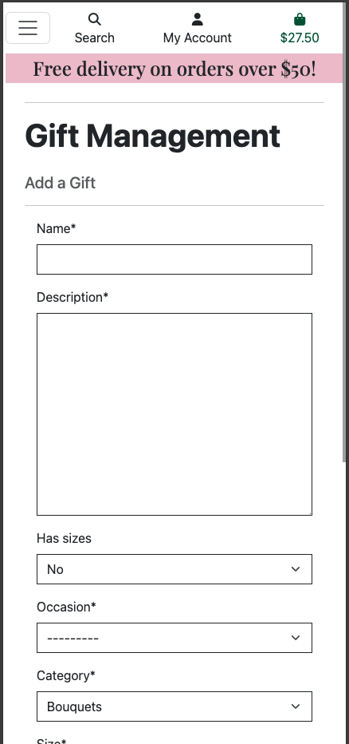
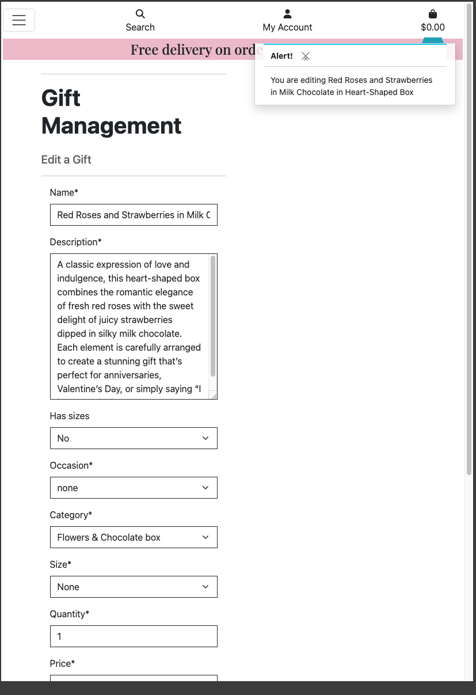

# Testing

> [!NOTE]
> Return back to the [README.md](README.md) file.

## Code Validation

### HTML

I have used the recommended [HTML W3C Validator](https://validator.w3.org) to validate all of my HTML files.

| Directory | File | URL | Screenshot | Notes |
| --- | --- | --- | --- | --- |
| bag | [bag.html](https://github.com/dfedyachkina/my-gifted-moments/blob/main/bag/templates/bag/bag.html) | https://validator.w3.org/nu/?doc=https%3A%2F%2Fmy-gifted-moments-154948e92f6b.herokuapp.com%2Fbag%2F |  | Notes (if applicable) |
| checkout | [checkout.html](https://github.com/dfedyachkina/my-gifted-moments/blob/main/checkout/templates/checkout/checkout.html) | https://validator.w3.org/nu/?doc=https%3A%2F%2Fmy-gifted-moments-154948e92f6b.herokuapp.com%2Fcheckout |  | Notes (if applicable) |
| checkout | [checkout_success.html](https://github.com/dfedyachkina/my-gifted-moments/blob/main/checkout/templates/checkout/checkout_success.html) | Link (if applicable) |  | Notes (if applicable) |
| contact | [contact.html](https://github.com/dfedyachkina/my-gifted-moments/blob/main/contact/templates/contact/contact.html) | https://validator.w3.org/nu/?doc=https%3A%2F%2Fmy-gifted-moments-154948e92f6b.herokuapp.com%2Fcontact |  | Notes (if applicable) |
| faq | [faq_list.html](https://github.com/dfedyachkina/my-gifted-moments/blob/main/faq/templates/faq/faq_list.html) | https://validator.w3.org/nu/?doc=https%3A%2F%2Fmy-gifted-moments-154948e92f6b.herokuapp.com%2Ffaq|  | Notes (if applicable) |
| favorites | [favorite_list.html](https://github.com/dfedyachkina/my-gifted-moments/blob/main/favorites/templates/favorites/favorite_list.html) | Link (if applicable) |  | Notes (if applicable) |
| gifts | [add_gift.html](https://github.com/dfedyachkina/my-gifted-moments/blob/main/gifts/templates/gifts/add_gift.html) | Link (if applicable) |  | Notes (if applicable) |
| gifts | [edit_gift.html](https://github.com/dfedyachkina/my-gifted-moments/blob/main/gifts/templates/gifts/edit_gift.html) | Link (if applicable) |  | Notes (if applicable) |
| gifts | [gift_detail.html](https://github.com/dfedyachkina/my-gifted-moments/blob/main/gifts/templates/gifts/gift_detail.html) | https://validator.w3.org/nu/?doc=https%3A%2F%2Fmy-gifted-moments-154948e92f6b.herokuapp.com%2Fgifts%2Fgift%2F1 |  | Notes (if applicable) |
| gifts | [gift_list.html](https://github.com/dfedyachkina/my-gifted-moments/blob/main/gifts/templates/gifts/gift_list.html) | https://validator.w3.org/nu/?doc=https%3A%2F%2Fmy-gifted-moments-154948e92f6b.herokuapp.com%2Fgifts|  | Notes (if applicable) |
| home | [index.html](https://github.com/dfedyachkina/my-gifted-moments/blob/main/home/templates/home/index.html) | https://validator.w3.org/nu/?doc=https%3A%2F%2Fmy-gifted-moments-154948e92f6b.herokuapp.com%2F |  | Notes (if applicable) |
| profiles | [profile.html](https://github.com/dfedyachkina/my-gifted-moments/blob/main/profiles/templates/profiles/profile.html) | Link (if applicable) |  | Notes (if applicable) |
| templates | [404.html](https://github.com/dfedyachkina/my-gifted-moments/blob/main/templates/errors/404.html) | Link (if applicable) |  | Notes (if applicable) |

### CSS

I have used the recommended [CSS Jigsaw Validator](https://jigsaw.w3.org/css-validator) to validate all of my CSS files.

| Directory | File | URL | Screenshot | Notes |
| --- | --- | --- | --- | --- |
| checkout | [checkout.css](https://github.com/dfedyachkina/my-gifted-moments/blob/main/checkout/static/checkout/css/checkout.css) | Link (if applicable) |  | Notes (if applicable) |
| profiles | [profile.css](https://github.com/dfedyachkina/my-gifted-moments/blob/main/profiles/static/profiles/css/profile.css) | Link (if applicable) |  | Notes (if applicable) |
| static | [base.css](https://github.com/dfedyachkina/my-gifted-moments/blob/main/static/css/base.css) | https://jigsaw.w3.org/css-validator/validator?uri=https://my-gifted-moments-154948e92f6b.herokuapp.com |  | Notes (if applicable) |

### JavaScript

I have used the recommended [JShint Validator](https://jshint.com) to validate all of my JS files.

| Directory | File | URL | Screenshot | Notes |
| --- | --- | --- | --- | --- |
| checkout | [stripe_elements.js](https://github.com/dfedyachkina/my-gifted-moments/blob/main/checkout/static/checkout/js/stripe_elements.js) | N/A |  | Notes (if applicable) |
| profiles | [countryfield.js](https://github.com/dfedyachkina/my-gifted-moments/blob/main/profiles/static/profiles/js/countryfield.js) | N/A |  | Notes (if applicable) |

### Python

I have used the recommended [PEP8 CI Python Linter](https://pep8ci.herokuapp.com) to validate all of my Python files.

| Directory | File | URL | Screenshot | Notes |
| --- | --- | --- | --- | --- |
| bag | [admin.py](https://github.com/dfedyachkina/my-gifted-moments/blob/main/bag/admin.py) | [PEP8 CI Link](https://pep8ci.herokuapp.com/https://raw.githubusercontent.com/dfedyachkina/my-gifted-moments/main/bag/admin.py) |  | Notes (if applicable) |
| bag | [contexts.py](https://github.com/dfedyachkina/my-gifted-moments/blob/main/bag/contexts.py) | [PEP8 CI Link](https://pep8ci.herokuapp.com/https://raw.githubusercontent.com/dfedyachkina/my-gifted-moments/main/bag/contexts.py) |  | Notes (if applicable) |
| bag | [models.py](https://github.com/dfedyachkina/my-gifted-moments/blob/main/bag/models.py) | [PEP8 CI Link](https://pep8ci.herokuapp.com/https://raw.githubusercontent.com/dfedyachkina/my-gifted-moments/main/bag/models.py) |  | Notes (if applicable) |
| bag | [bag_tools.py](https://github.com/dfedyachkina/my-gifted-moments/blob/main/bag/templatetags/bag_tools.py) | [PEP8 CI Link](https://pep8ci.herokuapp.com/https://raw.githubusercontent.com/dfedyachkina/my-gifted-moments/main/bag/templatetags/bag_tools.py) |  | Notes (if applicable) |
| bag | [tests.py](https://github.com/dfedyachkina/my-gifted-moments/blob/main/bag/tests.py) | [PEP8 CI Link](https://pep8ci.herokuapp.com/https://raw.githubusercontent.com/dfedyachkina/my-gifted-moments/main/bag/tests.py) |  | Notes (if applicable) |
| bag | [urls.py](https://github.com/dfedyachkina/my-gifted-moments/blob/main/bag/urls.py) | [PEP8 CI Link](https://pep8ci.herokuapp.com/https://raw.githubusercontent.com/dfedyachkina/my-gifted-moments/main/bag/urls.py) |  | Notes (if applicable) |
| bag | [views.py](https://github.com/dfedyachkina/my-gifted-moments/blob/main/bag/views.py) | [PEP8 CI Link](https://pep8ci.herokuapp.com/https://raw.githubusercontent.com/dfedyachkina/my-gifted-moments/main/bag/views.py) |  | Notes (if applicable) |
| checkout | [admin.py](https://github.com/dfedyachkina/my-gifted-moments/blob/main/checkout/admin.py) | [PEP8 CI Link](https://pep8ci.herokuapp.com/https://raw.githubusercontent.com/dfedyachkina/my-gifted-moments/main/checkout/admin.py) |  | Notes (if applicable) |
| checkout | [forms.py](https://github.com/dfedyachkina/my-gifted-moments/blob/main/checkout/forms.py) | [PEP8 CI Link](https://pep8ci.herokuapp.com/https://raw.githubusercontent.com/dfedyachkina/my-gifted-moments/main/checkout/forms.py) |  | Notes (if applicable) |
| checkout | [models.py](https://github.com/dfedyachkina/my-gifted-moments/blob/main/checkout/models.py) | [PEP8 CI Link](https://pep8ci.herokuapp.com/https://raw.githubusercontent.com/dfedyachkina/my-gifted-moments/main/checkout/models.py) |  | Notes (if applicable) |
| checkout | [signals.py](https://github.com/dfedyachkina/my-gifted-moments/blob/main/checkout/signals.py) | [PEP8 CI Link](https://pep8ci.herokuapp.com/https://raw.githubusercontent.com/dfedyachkina/my-gifted-moments/main/checkout/signals.py) |  | Notes (if applicable) |
| checkout | [tests.py](https://github.com/dfedyachkina/my-gifted-moments/blob/main/checkout/tests.py) | [PEP8 CI Link](https://pep8ci.herokuapp.com/https://raw.githubusercontent.com/dfedyachkina/my-gifted-moments/main/checkout/tests.py) |  | Notes (if applicable) |
| checkout | [urls.py](https://github.com/dfedyachkina/my-gifted-moments/blob/main/checkout/urls.py) | [PEP8 CI Link](https://pep8ci.herokuapp.com/https://raw.githubusercontent.com/dfedyachkina/my-gifted-moments/main/checkout/urls.py) |  | Notes (if applicable) |
| checkout | [views.py](https://github.com/dfedyachkina/my-gifted-moments/blob/main/checkout/views.py) | [PEP8 CI Link](https://pep8ci.herokuapp.com/https://raw.githubusercontent.com/dfedyachkina/my-gifted-moments/main/checkout/views.py) |  | Notes (if applicable) |
| checkout | [webhook_handler.py](https://github.com/dfedyachkina/my-gifted-moments/blob/main/checkout/webhook_handler.py) | [PEP8 CI Link](https://pep8ci.herokuapp.com/https://raw.githubusercontent.com/dfedyachkina/my-gifted-moments/main/checkout/webhook_handler.py) |  | Notes (if applicable) |
| contact | [admin.py](https://github.com/dfedyachkina/my-gifted-moments/blob/main/contact/admin.py) | [PEP8 CI Link](https://pep8ci.herokuapp.com/https://raw.githubusercontent.com/dfedyachkina/my-gifted-moments/main/contact/admin.py) |  | Notes (if applicable) |
| contact | [forms.py](https://github.com/dfedyachkina/my-gifted-moments/blob/main/contact/forms.py) | [PEP8 CI Link](https://pep8ci.herokuapp.com/https://raw.githubusercontent.com/dfedyachkina/my-gifted-moments/main/contact/forms.py) |  | Notes (if applicable) |
| contact | [models.py](https://github.com/dfedyachkina/my-gifted-moments/blob/main/contact/models.py) | [PEP8 CI Link](https://pep8ci.herokuapp.com/https://raw.githubusercontent.com/dfedyachkina/my-gifted-moments/main/contact/models.py) |  | Notes (if applicable) |
| contact | [tests.py](https://github.com/dfedyachkina/my-gifted-moments/blob/main/contact/tests.py) | [PEP8 CI Link](https://pep8ci.herokuapp.com/https://raw.githubusercontent.com/dfedyachkina/my-gifted-moments/main/contact/tests.py) |  | Notes (if applicable) |
| contact | [urls.py](https://github.com/dfedyachkina/my-gifted-moments/blob/main/contact/urls.py) | [PEP8 CI Link](https://pep8ci.herokuapp.com/https://raw.githubusercontent.com/dfedyachkina/my-gifted-moments/main/contact/urls.py) |  | Notes (if applicable) |
| contact | [views.py](https://github.com/dfedyachkina/my-gifted-moments/blob/main/contact/views.py) | [PEP8 CI Link](https://pep8ci.herokuapp.com/https://raw.githubusercontent.com/dfedyachkina/my-gifted-moments/main/contact/views.py) |  | Notes (if applicable) |
| faq | [admin.py](https://github.com/dfedyachkina/my-gifted-moments/blob/main/faq/admin.py) | [PEP8 CI Link](https://pep8ci.herokuapp.com/https://raw.githubusercontent.com/dfedyachkina/my-gifted-moments/main/faq/admin.py) |  | Notes (if applicable) |
| faq | [models.py](https://github.com/dfedyachkina/my-gifted-moments/blob/main/faq/models.py) | [PEP8 CI Link](https://pep8ci.herokuapp.com/https://raw.githubusercontent.com/dfedyachkina/my-gifted-moments/main/faq/models.py) |  | Notes (if applicable) |
| faq | [tests.py](https://github.com/dfedyachkina/my-gifted-moments/blob/main/faq/tests.py) | [PEP8 CI Link](https://pep8ci.herokuapp.com/https://raw.githubusercontent.com/dfedyachkina/my-gifted-moments/main/faq/tests.py) |  | Notes (if applicable) |
| faq | [urls.py](https://github.com/dfedyachkina/my-gifted-moments/blob/main/faq/urls.py) | [PEP8 CI Link](https://pep8ci.herokuapp.com/https://raw.githubusercontent.com/dfedyachkina/my-gifted-moments/main/faq/urls.py) |  | Notes (if applicable) |
| faq | [views.py](https://github.com/dfedyachkina/my-gifted-moments/blob/main/faq/views.py) | [PEP8 CI Link](https://pep8ci.herokuapp.com/https://raw.githubusercontent.com/dfedyachkina/my-gifted-moments/main/faq/views.py) |  | Notes (if applicable) |
| favorites | [admin.py](https://github.com/dfedyachkina/my-gifted-moments/blob/main/favorites/admin.py) | [PEP8 CI Link](https://pep8ci.herokuapp.com/https://raw.githubusercontent.com/dfedyachkina/my-gifted-moments/main/favorites/admin.py) |  | Notes (if applicable) |
| favorites | [models.py](https://github.com/dfedyachkina/my-gifted-moments/blob/main/favorites/models.py) | [PEP8 CI Link](https://pep8ci.herokuapp.com/https://raw.githubusercontent.com/dfedyachkina/my-gifted-moments/main/favorites/models.py) |  | Notes (if applicable) |
| favorites | [tests.py](https://github.com/dfedyachkina/my-gifted-moments/blob/main/favorites/tests.py) | [PEP8 CI Link](https://pep8ci.herokuapp.com/https://raw.githubusercontent.com/dfedyachkina/my-gifted-moments/main/favorites/tests.py) |  | Notes (if applicable) |
| favorites | [urls.py](https://github.com/dfedyachkina/my-gifted-moments/blob/main/favorites/urls.py) | [PEP8 CI Link](https://pep8ci.herokuapp.com/https://raw.githubusercontent.com/dfedyachkina/my-gifted-moments/main/favorites/urls.py) |  | Notes (if applicable) |
| favorites | [views.py](https://github.com/dfedyachkina/my-gifted-moments/blob/main/favorites/views.py) | [PEP8 CI Link](https://pep8ci.herokuapp.com/https://raw.githubusercontent.com/dfedyachkina/my-gifted-moments/main/favorites/views.py) |  | Notes (if applicable) |
| gifts | [admin.py](https://github.com/dfedyachkina/my-gifted-moments/blob/main/gifts/admin.py) | [PEP8 CI Link](https://pep8ci.herokuapp.com/https://raw.githubusercontent.com/dfedyachkina/my-gifted-moments/main/gifts/admin.py) |  | Notes (if applicable) |
| gifts | [forms.py](https://github.com/dfedyachkina/my-gifted-moments/blob/main/gifts/forms.py) | [PEP8 CI Link](https://pep8ci.herokuapp.com/https://raw.githubusercontent.com/dfedyachkina/my-gifted-moments/main/gifts/forms.py) |  | Notes (if applicable) |
| gifts | [models.py](https://github.com/dfedyachkina/my-gifted-moments/blob/main/gifts/models.py) | [PEP8 CI Link](https://pep8ci.herokuapp.com/https://raw.githubusercontent.com/dfedyachkina/my-gifted-moments/main/gifts/models.py) |  | Notes (if applicable) |
| gifts | [tests.py](https://github.com/dfedyachkina/my-gifted-moments/blob/main/gifts/tests.py) | [PEP8 CI Link](https://pep8ci.herokuapp.com/https://raw.githubusercontent.com/dfedyachkina/my-gifted-moments/main/gifts/tests.py) |  | Notes (if applicable) |
| gifts | [urls.py](https://github.com/dfedyachkina/my-gifted-moments/blob/main/gifts/urls.py) | [PEP8 CI Link](https://pep8ci.herokuapp.com/https://raw.githubusercontent.com/dfedyachkina/my-gifted-moments/main/gifts/urls.py) |  | Notes (if applicable) |
| gifts | [views.py](https://github.com/dfedyachkina/my-gifted-moments/blob/main/gifts/views.py) | [PEP8 CI Link](https://pep8ci.herokuapp.com/https://raw.githubusercontent.com/dfedyachkina/my-gifted-moments/main/gifts/views.py) |  | Notes (if applicable) |
| gifts | [widgets.py](https://github.com/dfedyachkina/my-gifted-moments/blob/main/gifts/widgets.py) | [PEP8 CI Link](https://pep8ci.herokuapp.com/https://raw.githubusercontent.com/dfedyachkina/my-gifted-moments/main/gifts/widgets.py) |  | Notes (if applicable) |
| home | [admin.py](https://github.com/dfedyachkina/my-gifted-moments/blob/main/home/admin.py) | [PEP8 CI Link](https://pep8ci.herokuapp.com/https://raw.githubusercontent.com/dfedyachkina/my-gifted-moments/main/home/admin.py) |  | Notes (if applicable) |
| home | [models.py](https://github.com/dfedyachkina/my-gifted-moments/blob/main/home/models.py) | [PEP8 CI Link](https://pep8ci.herokuapp.com/https://raw.githubusercontent.com/dfedyachkina/my-gifted-moments/main/home/models.py) |  | Notes (if applicable) |
| home | [tests.py](https://github.com/dfedyachkina/my-gifted-moments/blob/main/home/tests.py) | [PEP8 CI Link](https://pep8ci.herokuapp.com/https://raw.githubusercontent.com/dfedyachkina/my-gifted-moments/main/home/tests.py) |  | Notes (if applicable) |
| home | [urls.py](https://github.com/dfedyachkina/my-gifted-moments/blob/main/home/urls.py) | [PEP8 CI Link](https://pep8ci.herokuapp.com/https://raw.githubusercontent.com/dfedyachkina/my-gifted-moments/main/home/urls.py) |  | Notes (if applicable) |
| home | [views.py](https://github.com/dfedyachkina/my-gifted-moments/blob/main/home/views.py) | [PEP8 CI Link](https://pep8ci.herokuapp.com/https://raw.githubusercontent.com/dfedyachkina/my-gifted-moments/main/home/views.py) |  | Notes (if applicable) |
|  | [manage.py](https://github.com/dfedyachkina/my-gifted-moments/blob/main/manage.py) | [PEP8 CI Link](https://pep8ci.herokuapp.com/https://raw.githubusercontent.com/dfedyachkina/my-gifted-moments/main/manage.py) |  | Notes (if applicable) |
| my_gifted_moments | [settings.py](https://github.com/dfedyachkina/my-gifted-moments/blob/main/my_gifted_moments/settings.py) | [PEP8 CI Link](https://pep8ci.herokuapp.com/https://raw.githubusercontent.com/dfedyachkina/my-gifted-moments/main/my_gifted_moments/settings.py) |  | Notes (if applicable) |
| my_gifted_moments | [urls.py](https://github.com/dfedyachkina/my-gifted-moments/blob/main/my_gifted_moments/urls.py) | [PEP8 CI Link](https://pep8ci.herokuapp.com/https://raw.githubusercontent.com/dfedyachkina/my-gifted-moments/main/my_gifted_moments/urls.py) |  | Notes (if applicable) |
| my_gifted_moments | [views.py](https://github.com/dfedyachkina/my-gifted-moments/blob/main/my_gifted_moments/views.py) | [PEP8 CI Link](https://pep8ci.herokuapp.com/https://raw.githubusercontent.com/dfedyachkina/my-gifted-moments/main/my_gifted_moments/views.py) |  | Notes (if applicable) |
| profiles | [admin.py](https://github.com/dfedyachkina/my-gifted-moments/blob/main/profiles/admin.py) | [PEP8 CI Link](https://pep8ci.herokuapp.com/https://raw.githubusercontent.com/dfedyachkina/my-gifted-moments/main/profiles/admin.py) |  | Notes (if applicable) |
| profiles | [forms.py](https://github.com/dfedyachkina/my-gifted-moments/blob/main/profiles/forms.py) | [PEP8 CI Link](https://pep8ci.herokuapp.com/https://raw.githubusercontent.com/dfedyachkina/my-gifted-moments/main/profiles/forms.py) |  | Notes (if applicable) |
| profiles | [models.py](https://github.com/dfedyachkina/my-gifted-moments/blob/main/profiles/models.py) | [PEP8 CI Link](https://pep8ci.herokuapp.com/https://raw.githubusercontent.com/dfedyachkina/my-gifted-moments/main/profiles/models.py) |  | Notes (if applicable) |
| profiles | [tests.py](https://github.com/dfedyachkina/my-gifted-moments/blob/main/profiles/tests.py) | [PEP8 CI Link](https://pep8ci.herokuapp.com/https://raw.githubusercontent.com/dfedyachkina/my-gifted-moments/main/profiles/tests.py) |  | Notes (if applicable) |
| profiles | [urls.py](https://github.com/dfedyachkina/my-gifted-moments/blob/main/profiles/urls.py) | [PEP8 CI Link](https://pep8ci.herokuapp.com/https://raw.githubusercontent.com/dfedyachkina/my-gifted-moments/main/profiles/urls.py) |  | Notes (if applicable) |
| profiles | [views.py](https://github.com/dfedyachkina/my-gifted-moments/blob/main/profiles/views.py) | [PEP8 CI Link](https://pep8ci.herokuapp.com/https://raw.githubusercontent.com/dfedyachkina/my-gifted-moments/main/profiles/views.py) |  | Notes (if applicable) |

## Responsiveness

I've tested my deployed project to check for responsiveness issues.

| Page | Mobile | Tablet | Desktop | Notes |
| --- | --- | --- | --- | --- |
| Register |  |  |  | Works as expected |
| Login |  |  |  | Works as expected |
| Logout |  |  |  | Works as expected |
| Profile |  |  |  | Works as expected |
| Home |  |  |  | Works as expected |
| Gifts |  |  |  | Works as expected |
| Gift Details |  |  |  | Works as expected |
| Bag |  |  |  | Works as expected |
| Checkout |  |  |  | Works as expected |
| Checkout Success |  |  |  | Works as expected |
| Favorite List |  |  |  | Works as expected |
| Add Gift |  |  |  | Works as expected |
| Edit Gift |  |  |  | Works as expected |
| Newsletter |  |  |  | Works as expected |
| FAQ |  |  |  | Works as expected |
| Contact |  |  |  | Works as expected |
| 404 |  |  |  | Works as expected |

