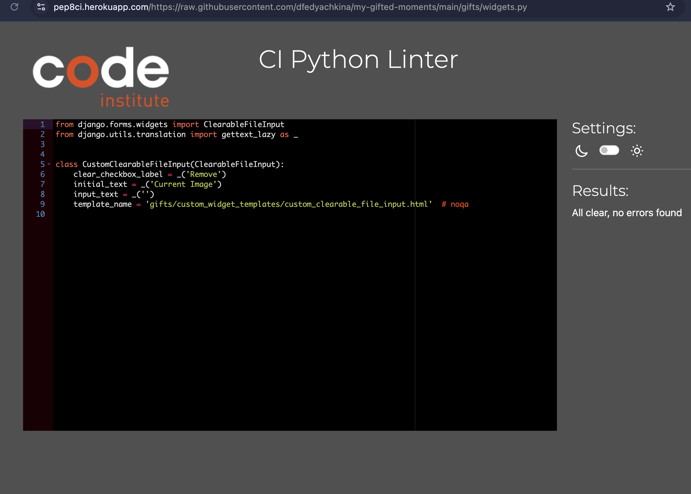
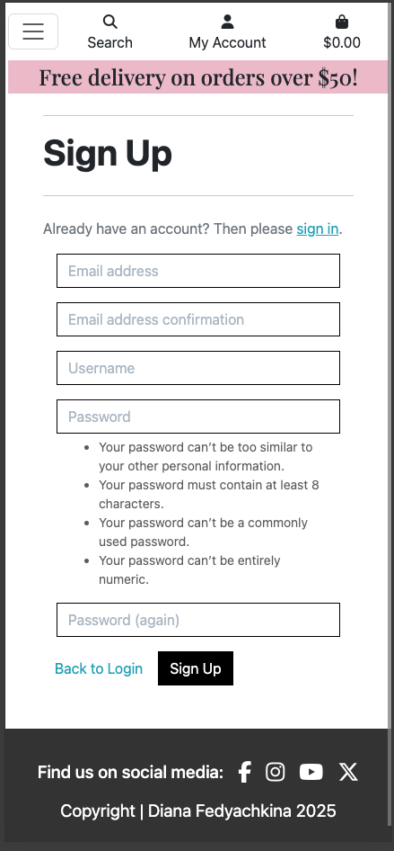
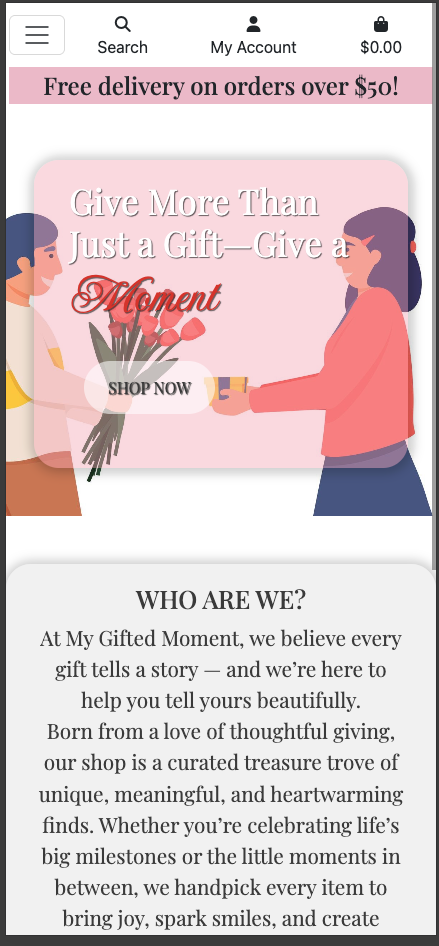
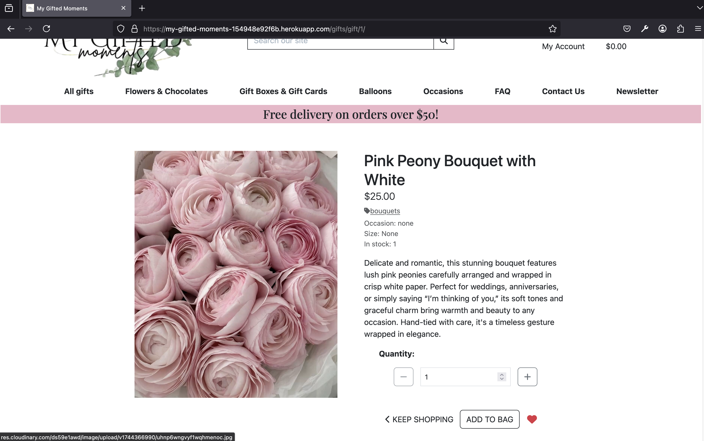
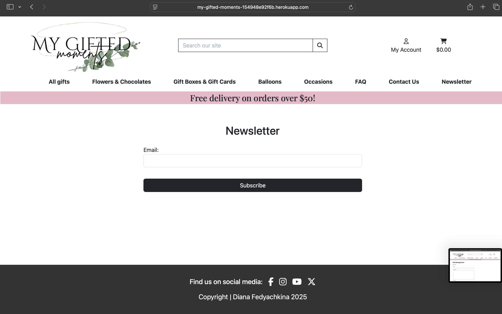
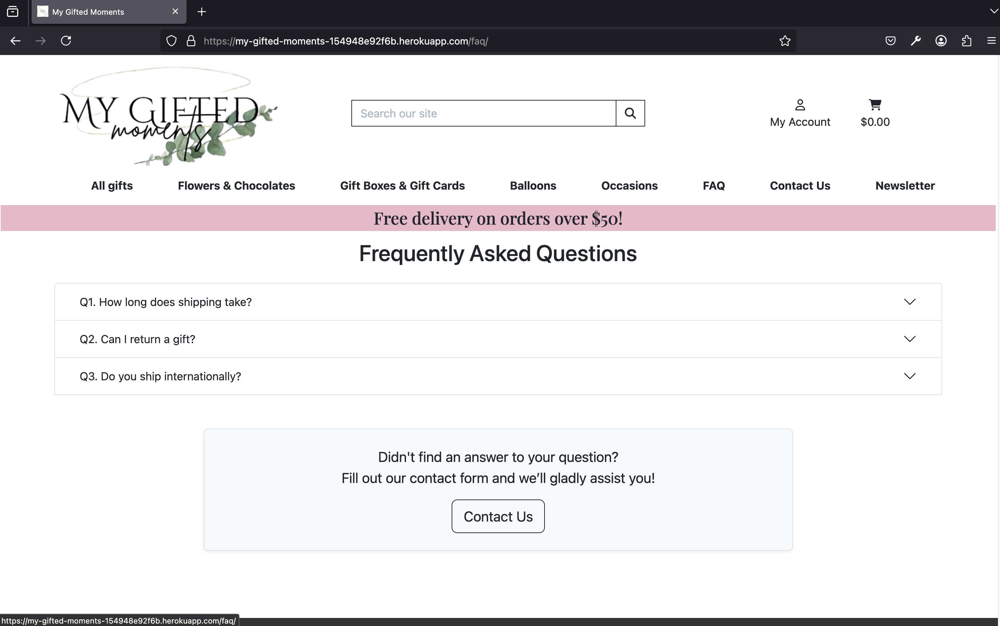
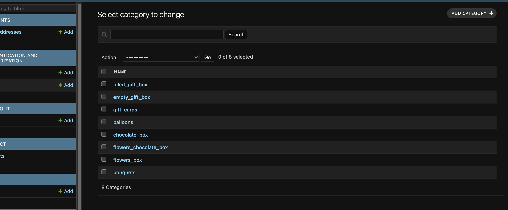

# Testing

> [!NOTE]
> Return back to the [README.md](README.md) file.

## Code Validation

### HTML

I have used the recommended [HTML W3C Validator](https://validator.w3.org) to validate all of my HTML files.

| Directory | File | URL | Screenshot | Notes |
| --- | --- | --- | --- | --- |
| bag | [bag.html](https://github.com/dfedyachkina/my-gifted-moments/blob/main/bag/templates/bag/bag.html) | https://validator.w3.org/nu/?doc=https%3A%2F%2Fmy-gifted-moments-154948e92f6b.herokuapp.com%2Fbag%2F |  | Notes (if applicable) |
| checkout | [checkout.html](https://github.com/dfedyachkina/my-gifted-moments/blob/main/checkout/templates/checkout/checkout.html) | https://validator.w3.org/nu/?doc=https%3A%2F%2Fmy-gifted-moments-154948e92f6b.herokuapp.com%2Fcheckout |  | Notes (if applicable) |
| checkout | [checkout_success.html](https://github.com/dfedyachkina/my-gifted-moments/blob/main/checkout/templates/checkout/checkout_success.html) | Link (if applicable) |  | Notes (if applicable) |
| contact | [contact.html](https://github.com/dfedyachkina/my-gifted-moments/blob/main/contact/templates/contact/contact.html) | https://validator.w3.org/nu/?doc=https%3A%2F%2Fmy-gifted-moments-154948e92f6b.herokuapp.com%2Fcontact |  | Notes (if applicable) |
| faq | [faq_list.html](https://github.com/dfedyachkina/my-gifted-moments/blob/main/faq/templates/faq/faq_list.html) | https://validator.w3.org/nu/?doc=https%3A%2F%2Fmy-gifted-moments-154948e92f6b.herokuapp.com%2Ffaq|  | Notes (if applicable) |
| favorites | [favorite_list.html](https://github.com/dfedyachkina/my-gifted-moments/blob/main/favorites/templates/favorites/favorite_list.html) | Link (if applicable) |  | Notes (if applicable) |
| gifts | [add_gift.html](https://github.com/dfedyachkina/my-gifted-moments/blob/main/gifts/templates/gifts/add_gift.html) | Link (if applicable) |  | Notes (if applicable) |
| gifts | [edit_gift.html](https://github.com/dfedyachkina/my-gifted-moments/blob/main/gifts/templates/gifts/edit_gift.html) | Link (if applicable) |  | Notes (if applicable) |
| gifts | [gift_detail.html](https://github.com/dfedyachkina/my-gifted-moments/blob/main/gifts/templates/gifts/gift_detail.html) | https://validator.w3.org/nu/?doc=https%3A%2F%2Fmy-gifted-moments-154948e92f6b.herokuapp.com%2Fgifts%2Fgift%2F1 |  | Notes (if applicable) |
| gifts | [gift_list.html](https://github.com/dfedyachkina/my-gifted-moments/blob/main/gifts/templates/gifts/gift_list.html) | https://validator.w3.org/nu/?doc=https%3A%2F%2Fmy-gifted-moments-154948e92f6b.herokuapp.com%2Fgifts|  | Notes (if applicable) |
| home | [index.html](https://github.com/dfedyachkina/my-gifted-moments/blob/main/home/templates/home/index.html) | https://validator.w3.org/nu/?doc=https%3A%2F%2Fmy-gifted-moments-154948e92f6b.herokuapp.com%2F |  | Notes (if applicable) |
| profiles | [profile.html](https://github.com/dfedyachkina/my-gifted-moments/blob/main/profiles/templates/profiles/profile.html) | Link (if applicable) |  | Notes (if applicable) |
| templates | [404.html](https://github.com/dfedyachkina/my-gifted-moments/blob/main/templates/errors/404.html) | Link (if applicable) |  | Notes (if applicable) |

### CSS

I have used the recommended [CSS Jigsaw Validator](https://jigsaw.w3.org/css-validator) to validate all of my CSS files.

| Directory | File | URL | Screenshot | Notes |
| --- | --- | --- | --- | --- |
| checkout | [checkout.css](https://github.com/dfedyachkina/my-gifted-moments/blob/main/checkout/static/checkout/css/checkout.css) | Link (if applicable) |  | Notes (if applicable) |
| profiles | [profile.css](https://github.com/dfedyachkina/my-gifted-moments/blob/main/profiles/static/profiles/css/profile.css) | Link (if applicable) |  | Notes (if applicable) |
| static | [base.css](https://github.com/dfedyachkina/my-gifted-moments/blob/main/static/css/base.css) | https://jigsaw.w3.org/css-validator/validator?uri=https://my-gifted-moments-154948e92f6b.herokuapp.com |  | Notes (if applicable) |

### JavaScript

I have used the recommended [JShint Validator](https://jshint.com) to validate all of my JS files.

| Directory | File | URL | Screenshot | Notes |
| --- | --- | --- | --- | --- |
| checkout | [stripe_elements.js](https://github.com/dfedyachkina/my-gifted-moments/blob/main/checkout/static/checkout/js/stripe_elements.js) | N/A |  | Notes (if applicable) |
| profiles | [countryfield.js](https://github.com/dfedyachkina/my-gifted-moments/blob/main/profiles/static/profiles/js/countryfield.js) | N/A |  | Notes (if applicable) |

### Python

I have used the recommended [PEP8 CI Python Linter](https://pep8ci.herokuapp.com) to validate all of my Python files.

| Directory | File | URL | Screenshot | Notes |
| --- | --- | --- | --- | --- |
| bag | [admin.py](https://github.com/dfedyachkina/my-gifted-moments/blob/main/bag/admin.py) | [PEP8 CI Link](https://pep8ci.herokuapp.com/https://raw.githubusercontent.com/dfedyachkina/my-gifted-moments/main/bag/admin.py) |  | Notes (if applicable) |
| bag | [contexts.py](https://github.com/dfedyachkina/my-gifted-moments/blob/main/bag/contexts.py) | [PEP8 CI Link](https://pep8ci.herokuapp.com/https://raw.githubusercontent.com/dfedyachkina/my-gifted-moments/main/bag/contexts.py) |  | Notes (if applicable) |
| bag | [models.py](https://github.com/dfedyachkina/my-gifted-moments/blob/main/bag/models.py) | [PEP8 CI Link](https://pep8ci.herokuapp.com/https://raw.githubusercontent.com/dfedyachkina/my-gifted-moments/main/bag/models.py) |  | Notes (if applicable) |
| bag | [bag_tools.py](https://github.com/dfedyachkina/my-gifted-moments/blob/main/bag/templatetags/bag_tools.py) | [PEP8 CI Link](https://pep8ci.herokuapp.com/https://raw.githubusercontent.com/dfedyachkina/my-gifted-moments/main/bag/templatetags/bag_tools.py) |  | Notes (if applicable) |
| bag | [tests.py](https://github.com/dfedyachkina/my-gifted-moments/blob/main/bag/tests.py) | [PEP8 CI Link](https://pep8ci.herokuapp.com/https://raw.githubusercontent.com/dfedyachkina/my-gifted-moments/main/bag/tests.py) |  | Notes (if applicable) |
| bag | [urls.py](https://github.com/dfedyachkina/my-gifted-moments/blob/main/bag/urls.py) | [PEP8 CI Link](https://pep8ci.herokuapp.com/https://raw.githubusercontent.com/dfedyachkina/my-gifted-moments/main/bag/urls.py) |  | Notes (if applicable) |
| bag | [views.py](https://github.com/dfedyachkina/my-gifted-moments/blob/main/bag/views.py) | [PEP8 CI Link](https://pep8ci.herokuapp.com/https://raw.githubusercontent.com/dfedyachkina/my-gifted-moments/main/bag/views.py) |  | Notes (if applicable) |
| checkout | [admin.py](https://github.com/dfedyachkina/my-gifted-moments/blob/main/checkout/admin.py) | [PEP8 CI Link](https://pep8ci.herokuapp.com/https://raw.githubusercontent.com/dfedyachkina/my-gifted-moments/main/checkout/admin.py) |  | Notes (if applicable) |
| checkout | [forms.py](https://github.com/dfedyachkina/my-gifted-moments/blob/main/checkout/forms.py) | [PEP8 CI Link](https://pep8ci.herokuapp.com/https://raw.githubusercontent.com/dfedyachkina/my-gifted-moments/main/checkout/forms.py) |  | Notes (if applicable) |
| checkout | [models.py](https://github.com/dfedyachkina/my-gifted-moments/blob/main/checkout/models.py) | [PEP8 CI Link](https://pep8ci.herokuapp.com/https://raw.githubusercontent.com/dfedyachkina/my-gifted-moments/main/checkout/models.py) |  | Notes (if applicable) |
| checkout | [signals.py](https://github.com/dfedyachkina/my-gifted-moments/blob/main/checkout/signals.py) | [PEP8 CI Link](https://pep8ci.herokuapp.com/https://raw.githubusercontent.com/dfedyachkina/my-gifted-moments/main/checkout/signals.py) |  | Notes (if applicable) |
| checkout | [tests.py](https://github.com/dfedyachkina/my-gifted-moments/blob/main/checkout/tests.py) | [PEP8 CI Link](https://pep8ci.herokuapp.com/https://raw.githubusercontent.com/dfedyachkina/my-gifted-moments/main/checkout/tests.py) |  | Notes (if applicable) |
| checkout | [urls.py](https://github.com/dfedyachkina/my-gifted-moments/blob/main/checkout/urls.py) | [PEP8 CI Link](https://pep8ci.herokuapp.com/https://raw.githubusercontent.com/dfedyachkina/my-gifted-moments/main/checkout/urls.py) |  | Notes (if applicable) |
| checkout | [views.py](https://github.com/dfedyachkina/my-gifted-moments/blob/main/checkout/views.py) | [PEP8 CI Link](https://pep8ci.herokuapp.com/https://raw.githubusercontent.com/dfedyachkina/my-gifted-moments/main/checkout/views.py) |  | Notes (if applicable) |
| checkout | [webhook_handler.py](https://github.com/dfedyachkina/my-gifted-moments/blob/main/checkout/webhook_handler.py) | [PEP8 CI Link](https://pep8ci.herokuapp.com/https://raw.githubusercontent.com/dfedyachkina/my-gifted-moments/main/checkout/webhook_handler.py) |  | Notes (if applicable) |
| contact | [admin.py](https://github.com/dfedyachkina/my-gifted-moments/blob/main/contact/admin.py) | [PEP8 CI Link](https://pep8ci.herokuapp.com/https://raw.githubusercontent.com/dfedyachkina/my-gifted-moments/main/contact/admin.py) |  | Notes (if applicable) |
| contact | [forms.py](https://github.com/dfedyachkina/my-gifted-moments/blob/main/contact/forms.py) | [PEP8 CI Link](https://pep8ci.herokuapp.com/https://raw.githubusercontent.com/dfedyachkina/my-gifted-moments/main/contact/forms.py) |  | Notes (if applicable) |
| contact | [models.py](https://github.com/dfedyachkina/my-gifted-moments/blob/main/contact/models.py) | [PEP8 CI Link](https://pep8ci.herokuapp.com/https://raw.githubusercontent.com/dfedyachkina/my-gifted-moments/main/contact/models.py) |  | Notes (if applicable) |
| contact | [tests.py](https://github.com/dfedyachkina/my-gifted-moments/blob/main/contact/tests.py) | [PEP8 CI Link](https://pep8ci.herokuapp.com/https://raw.githubusercontent.com/dfedyachkina/my-gifted-moments/main/contact/tests.py) |  | Notes (if applicable) |
| contact | [urls.py](https://github.com/dfedyachkina/my-gifted-moments/blob/main/contact/urls.py) | [PEP8 CI Link](https://pep8ci.herokuapp.com/https://raw.githubusercontent.com/dfedyachkina/my-gifted-moments/main/contact/urls.py) |  | Notes (if applicable) |
| contact | [views.py](https://github.com/dfedyachkina/my-gifted-moments/blob/main/contact/views.py) | [PEP8 CI Link](https://pep8ci.herokuapp.com/https://raw.githubusercontent.com/dfedyachkina/my-gifted-moments/main/contact/views.py) |  | Notes (if applicable) |
| faq | [admin.py](https://github.com/dfedyachkina/my-gifted-moments/blob/main/faq/admin.py) | [PEP8 CI Link](https://pep8ci.herokuapp.com/https://raw.githubusercontent.com/dfedyachkina/my-gifted-moments/main/faq/admin.py) |  | Notes (if applicable) |
| faq | [models.py](https://github.com/dfedyachkina/my-gifted-moments/blob/main/faq/models.py) | [PEP8 CI Link](https://pep8ci.herokuapp.com/https://raw.githubusercontent.com/dfedyachkina/my-gifted-moments/main/faq/models.py) |  | Notes (if applicable) |
| faq | [tests.py](https://github.com/dfedyachkina/my-gifted-moments/blob/main/faq/tests.py) | [PEP8 CI Link](https://pep8ci.herokuapp.com/https://raw.githubusercontent.com/dfedyachkina/my-gifted-moments/main/faq/tests.py) |  | Notes (if applicable) |
| faq | [urls.py](https://github.com/dfedyachkina/my-gifted-moments/blob/main/faq/urls.py) | [PEP8 CI Link](https://pep8ci.herokuapp.com/https://raw.githubusercontent.com/dfedyachkina/my-gifted-moments/main/faq/urls.py) |  | Notes (if applicable) |
| faq | [views.py](https://github.com/dfedyachkina/my-gifted-moments/blob/main/faq/views.py) | [PEP8 CI Link](https://pep8ci.herokuapp.com/https://raw.githubusercontent.com/dfedyachkina/my-gifted-moments/main/faq/views.py) |  | Notes (if applicable) |
| favorites | [admin.py](https://github.com/dfedyachkina/my-gifted-moments/blob/main/favorites/admin.py) | [PEP8 CI Link](https://pep8ci.herokuapp.com/https://raw.githubusercontent.com/dfedyachkina/my-gifted-moments/main/favorites/admin.py) |  | Notes (if applicable) |
| favorites | [models.py](https://github.com/dfedyachkina/my-gifted-moments/blob/main/favorites/models.py) | [PEP8 CI Link](https://pep8ci.herokuapp.com/https://raw.githubusercontent.com/dfedyachkina/my-gifted-moments/main/favorites/models.py) |  | Notes (if applicable) |
| favorites | [tests.py](https://github.com/dfedyachkina/my-gifted-moments/blob/main/favorites/tests.py) | [PEP8 CI Link](https://pep8ci.herokuapp.com/https://raw.githubusercontent.com/dfedyachkina/my-gifted-moments/main/favorites/tests.py) |  | Notes (if applicable) |
| favorites | [urls.py](https://github.com/dfedyachkina/my-gifted-moments/blob/main/favorites/urls.py) | [PEP8 CI Link](https://pep8ci.herokuapp.com/https://raw.githubusercontent.com/dfedyachkina/my-gifted-moments/main/favorites/urls.py) |  | Notes (if applicable) |
| favorites | [views.py](https://github.com/dfedyachkina/my-gifted-moments/blob/main/favorites/views.py) | [PEP8 CI Link](https://pep8ci.herokuapp.com/https://raw.githubusercontent.com/dfedyachkina/my-gifted-moments/main/favorites/views.py) |  | Notes (if applicable) |
| gifts | [admin.py](https://github.com/dfedyachkina/my-gifted-moments/blob/main/gifts/admin.py) | [PEP8 CI Link](https://pep8ci.herokuapp.com/https://raw.githubusercontent.com/dfedyachkina/my-gifted-moments/main/gifts/admin.py) |  | Notes (if applicable) |
| gifts | [forms.py](https://github.com/dfedyachkina/my-gifted-moments/blob/main/gifts/forms.py) | [PEP8 CI Link](https://pep8ci.herokuapp.com/https://raw.githubusercontent.com/dfedyachkina/my-gifted-moments/main/gifts/forms.py) |  | Notes (if applicable) |
| gifts | [models.py](https://github.com/dfedyachkina/my-gifted-moments/blob/main/gifts/models.py) | [PEP8 CI Link](https://pep8ci.herokuapp.com/https://raw.githubusercontent.com/dfedyachkina/my-gifted-moments/main/gifts/models.py) |  | Notes (if applicable) |
| gifts | [tests.py](https://github.com/dfedyachkina/my-gifted-moments/blob/main/gifts/tests.py) | [PEP8 CI Link](https://pep8ci.herokuapp.com/https://raw.githubusercontent.com/dfedyachkina/my-gifted-moments/main/gifts/tests.py) |  | Notes (if applicable) |
| gifts | [urls.py](https://github.com/dfedyachkina/my-gifted-moments/blob/main/gifts/urls.py) | [PEP8 CI Link](https://pep8ci.herokuapp.com/https://raw.githubusercontent.com/dfedyachkina/my-gifted-moments/main/gifts/urls.py) |  | Notes (if applicable) |
| gifts | [views.py](https://github.com/dfedyachkina/my-gifted-moments/blob/main/gifts/views.py) | [PEP8 CI Link](https://pep8ci.herokuapp.com/https://raw.githubusercontent.com/dfedyachkina/my-gifted-moments/main/gifts/views.py) |  | Notes (if applicable) |
| gifts | [widgets.py](https://github.com/dfedyachkina/my-gifted-moments/blob/main/gifts/widgets.py) | [PEP8 CI Link](https://pep8ci.herokuapp.com/https://raw.githubusercontent.com/dfedyachkina/my-gifted-moments/main/gifts/widgets.py) |  | Notes (if applicable) |
| home | [admin.py](https://github.com/dfedyachkina/my-gifted-moments/blob/main/home/admin.py) | [PEP8 CI Link](https://pep8ci.herokuapp.com/https://raw.githubusercontent.com/dfedyachkina/my-gifted-moments/main/home/admin.py) |  | Notes (if applicable) |
| home | [models.py](https://github.com/dfedyachkina/my-gifted-moments/blob/main/home/models.py) | [PEP8 CI Link](https://pep8ci.herokuapp.com/https://raw.githubusercontent.com/dfedyachkina/my-gifted-moments/main/home/models.py) |  | Notes (if applicable) |
| home | [tests.py](https://github.com/dfedyachkina/my-gifted-moments/blob/main/home/tests.py) | [PEP8 CI Link](https://pep8ci.herokuapp.com/https://raw.githubusercontent.com/dfedyachkina/my-gifted-moments/main/home/tests.py) |  | Notes (if applicable) |
| home | [urls.py](https://github.com/dfedyachkina/my-gifted-moments/blob/main/home/urls.py) | [PEP8 CI Link](https://pep8ci.herokuapp.com/https://raw.githubusercontent.com/dfedyachkina/my-gifted-moments/main/home/urls.py) |  | Notes (if applicable) |
| home | [views.py](https://github.com/dfedyachkina/my-gifted-moments/blob/main/home/views.py) | [PEP8 CI Link](https://pep8ci.herokuapp.com/https://raw.githubusercontent.com/dfedyachkina/my-gifted-moments/main/home/views.py) |  | Notes (if applicable) |
|  | [manage.py](https://github.com/dfedyachkina/my-gifted-moments/blob/main/manage.py) | [PEP8 CI Link](https://pep8ci.herokuapp.com/https://raw.githubusercontent.com/dfedyachkina/my-gifted-moments/main/manage.py) |  | Notes (if applicable) |
| my_gifted_moments | [settings.py](https://github.com/dfedyachkina/my-gifted-moments/blob/main/my_gifted_moments/settings.py) | [PEP8 CI Link](https://pep8ci.herokuapp.com/https://raw.githubusercontent.com/dfedyachkina/my-gifted-moments/main/my_gifted_moments/settings.py) |  | Notes (if applicable) |
| my_gifted_moments | [urls.py](https://github.com/dfedyachkina/my-gifted-moments/blob/main/my_gifted_moments/urls.py) | [PEP8 CI Link](https://pep8ci.herokuapp.com/https://raw.githubusercontent.com/dfedyachkina/my-gifted-moments/main/my_gifted_moments/urls.py) |  | Notes (if applicable) |
| my_gifted_moments | [views.py](https://github.com/dfedyachkina/my-gifted-moments/blob/main/my_gifted_moments/views.py) | [PEP8 CI Link](https://pep8ci.herokuapp.com/https://raw.githubusercontent.com/dfedyachkina/my-gifted-moments/main/my_gifted_moments/views.py) |  | Notes (if applicable) |
| profiles | [admin.py](https://github.com/dfedyachkina/my-gifted-moments/blob/main/profiles/admin.py) | [PEP8 CI Link](https://pep8ci.herokuapp.com/https://raw.githubusercontent.com/dfedyachkina/my-gifted-moments/main/profiles/admin.py) |  | Notes (if applicable) |
| profiles | [forms.py](https://github.com/dfedyachkina/my-gifted-moments/blob/main/profiles/forms.py) | [PEP8 CI Link](https://pep8ci.herokuapp.com/https://raw.githubusercontent.com/dfedyachkina/my-gifted-moments/main/profiles/forms.py) |  | Notes (if applicable) |
| profiles | [models.py](https://github.com/dfedyachkina/my-gifted-moments/blob/main/profiles/models.py) | [PEP8 CI Link](https://pep8ci.herokuapp.com/https://raw.githubusercontent.com/dfedyachkina/my-gifted-moments/main/profiles/models.py) |  | Notes (if applicable) |
| profiles | [tests.py](https://github.com/dfedyachkina/my-gifted-moments/blob/main/profiles/tests.py) | [PEP8 CI Link](https://pep8ci.herokuapp.com/https://raw.githubusercontent.com/dfedyachkina/my-gifted-moments/main/profiles/tests.py) |  | Notes (if applicable) |
| profiles | [urls.py](https://github.com/dfedyachkina/my-gifted-moments/blob/main/profiles/urls.py) | [PEP8 CI Link](https://pep8ci.herokuapp.com/https://raw.githubusercontent.com/dfedyachkina/my-gifted-moments/main/profiles/urls.py) |  | Notes (if applicable) |
| profiles | [views.py](https://github.com/dfedyachkina/my-gifted-moments/blob/main/profiles/views.py) | [PEP8 CI Link](https://pep8ci.herokuapp.com/https://raw.githubusercontent.com/dfedyachkina/my-gifted-moments/main/profiles/views.py) |  | Notes (if applicable) |

## Responsiveness

I've tested my deployed project to check for responsiveness issues.

| Page | Mobile | Tablet | Desktop | Notes |
| --- | --- | --- | --- | --- |
| Register |  |  |  | Works as expected |
| Login |  |  |  | Works as expected |
| Logout |  |  |  | Works as expected |
| Profile |  |  |  | Works as expected |
| Home |  |  |  | Works as expected |
| Gifts |  |  |  | Works as expected |
| Gift Details |  |  |  | Works as expected |
| Bag |  |  |  | Works as expected |
| Checkout |  |  |  | Works as expected |
| Checkout Success |  |  |  | Works as expected |
| Favorite List |  |  |  | Works as expected |
| Add Gift |  |  |  | Works as expected |
| Edit Gift |  |  |  | Works as expected |
| Newsletter |  |  |  | Works as expected |
| FAQ |  |  |  | Works as expected |
| Contact |  |  |  | Works as expected |
| 404 |  |  |  | Works as expected |

## Browser Compatibility

I've tested my deployed project on multiple browsers to check for compatibility issues.

| Page | Chrome | Firefox | Safari | Notes |
| --- | --- | --- | --- | --- |
| Register |  |  |  | Works as expected |
| Login |  |  |  | Works as expected |
| Logout|  |  |  | Works as expected |
| Profile |  |  |  | Works as expected |
| Home |  |  |  | Works as expected |
| Gifts |  |  |  | Works as expected |
| Gift Details |  |  |  | Works as expected |
| Bag |  |  |  | Works as expected |
| Checkout |  |  |  | Works as expected |
| Checkout Success |  |  |  | Works as expected |
| Favorite List |  |  |  | Works as expected |
| Add Gift|  |  |  | Works as expected |
| Edit Gift|  |  |  | Works as expected |
| Newsletter |  |  |  | Works as expected |
| FAQ|  |  |  | Works as expected |
| Contact |  |  |  | Works as expected |
| 404 |  |  |  | Works as expected |

## Lighthouse Audit

I've tested my deployed project using the Lighthouse Audit tool to check for any major issues. Some warnings are outside of my control, and mobile results tend to be lower than desktop.

| Page | Mobile | Desktop |
| --- | --- | --- |
| Register |  |  |
| Login |  |  |
| Logout |  |  |
| Profile |  |  |
| Home |  |  |
| Gifts |  |  |
| Gift Details |  |  |
| Bag |  |  |
| Checkout |  |  |
| Checkout Success |  |  |
| Favorite list|  |  |
| Add Gift|  |  |
| Edit Gift |  |  |
| Newsletter |  |  |
| FAQ |  |  |
| Contact |  |  |
| 404 |  |  |

## Defensive Programming

Defensive programming was manually tested with the below user acceptance testing:

| Page | Expectation | Test | Result | Screenshot |
| --- | --- | --- | --- | --- |
| Home| Feature is expected to allow users to browse home page. | Opened home as a guest user. | Home page was displayed succesfully. |  |
| Gifts | Feature is expected to allow users to browse gifts without registration. | Opened gift pages as a guest user. | Gifts were fully accessible without requiring registration. |  |
| | Feature is expected to sort gift by price and name. | Tested sorting options for price (low-to-high/high-to-low) and name (alphabetical). | Sorting worked correctly for all options. |  |
| | Feature is expected to filter gifts by category. | Applied category filters while browsing products. | Filters worked as expected, displaying only relevant products. |  |
| | Feature is expected to filter gifts by occasion. | Applied occasion filters while browsing products. | Filters worked as expected, displaying only relevant products. |  |
| | Feature is expected to show detailed gift information. | Clicked on individual gifts to view details. | Gift details (description, price, image) were displayed correctly. |  |
| | Feature is expected to show serached items. | Go to search field and serah for an item. | Search page displayed correct items which were searched. |  |
| Favorite List | Feature is expected to allow registred users to add items to the wishlist. | Added gifts to the favorite list. | Items were added successfully. |  |
| | Feature is expected to allow registred users to view and manage their favorite list. | Opened the favorite list page and edited favorite items there. | Favorite list contents were displayed, updated, and removed correctly. |  |
| Shopping Cart | Feature is expected to allow customers to add items to the cart with quantity controls. | Added gifts to the cart and adjusted quantities. | Items were added successfully, and quantities updated as expected. |  |
| | Feature is expected to allow customers to view and manage their cart. | Opened the cart page and edited cart contents. | Cart contents were displayed, updated, and removed correctly. |  |
| Checkout | Feature is expected to display cart items, grand total, and input fields for checkout. | Proceeded to checkout with items in the cart. | Checkout page displayed cart items, total, and input fields as expected. |  |
| | Feature is expected to allow secure payment via Stripe. | Entered valid card details using Stripe at checkout. | Payment was processed securely, and an order confirmation page was displayed. |  |
| | Feature is expected to send a confirmation email after purchase. | Completed a purchase and checked email inbox. | Confirmation email was received with order details. |  |
| | Feature is expected to display an order confirmation page with an order number. | Completed a purchase. | Order confirmation page displayed successfully with an order number. |  |
| Account Management | Feature is expected to allow returning customers to log in and view past orders. | Logged in as a returning customer and accessed order history. | Past orders were displayed correctly in the account section. |  |
| | Feature is expected to remember the shipping address for returning customers. | Completed multiple checkouts as a returning customer. | Shipping address was pre-filled on subsequent purchases. |  |
| Admin Features | Feature is expected to allow the site owner to create new gifts. | Created new gifts with valid data (name, price, description, image, category). | Gift were added successfully and displayed on the site. |  |
| | Feature is expected to allow the site owner to update gift details. | Edited gift details as an admin user. | Gift updates were saved and displayed correctly. |  |
| | Feature is expected to allow the site owner to delete gifts. | Deleted a gift from the inventory. | Gift was removed successfully from the site, after being prompted to confirm first. |  |
| | Feature is expected to allow the site owner to receive a mail who has submitted contact form. | Submitted contact form. | Email has been received. |  |
| | Feature is expected to allow the site owner to manage FAQ from Django Admin dashboard | Went to Django Admin dashboeard and add a new question. | Email has been received. |  |
| Orders | Feature is expected to allow the site owner to view all orders placed. | Accessed the orders dashboard as an admin user. | All orders were displayed correctly. |  |
| Newsletter | Feature is expected to allow users to sign up for the newsletter. | Submitted valid email addresses for newsletter registration. | Email addresses were successfully added to the newsletter list. |  |
| Contact | Feature is expected to allow users to submit Contact Us form. | Submitted Contact Us form | The form has been submitted successfully |  |
| FAQ | Feature is expected to allow users to browse FAQ and expand answers | Went FAQ page and expand one of the questions | Answers have been displayed successfully |  |
| 404 Error Page | Feature is expected to display a 404 error page for non-existent pages. | Navigated to an invalid URL (e.g., `/test`). | A custom 404 error page was displayed as expected. |  |

## User Story Testing

| Target | Expectation | Outcome | Screenshot |
| --- | --- | --- | --- |
| As a guest user | I would like to browse gifts without needing to register | so that I can shop freely before deciding to create an account. |  |
| As a guest user | I would like to be prompted to create an account or log in at checkout | so that I can complete my purchase and track my order history. |  |
| As a guest user | I would like to browse FAQ page | so that I can find an answer to my question and get know more about store. |  |
| As a guest user | I would like to browse Contact Us page | so that I can fill the form and submit in case if I have a question or I want to be contacted by the store employee regarding my query. |  |
| As a user | I would like to sign up to the site's newsletter | so that I can stay up to date with any upcoming sales or promotions. |  |
| As a customer | I would like to browse various gift categories | so that I can easily find what I'm looking for. |  |
| As a customer | I would like to sort gifts by price (low-to-high/high-to-low) and name (alphabetical) | so that I can quickly organize items in a way that suits my shopping style. |  |
| As a customer | I would like to filter gifts by category | so that I can narrow down the gifts to the types I am most interested in. |  |
| As a customer | I would like to click on individual gifts to view more details (description, price, image, etc.) | so that I can make an informed decision about my purchase. |  |
| As a customer | I would like to add items to my shopping cart using quantity increment/decrement buttons | so that I can adjust how many units of a gift I want before checkout. |  |
| As a customer | I would like to view and manage my shopping cart | so that I can review, add, or remove items before proceeding to checkout. |  |
| As a customer | I would like to adjust the quantity of items in my cart | so that I can modify my purchase preferences without leaving the cart. |  |
| As a customer | I would like to remove items from my cart | so that I can remove products I no longer wish to buy. |  |
| As a customer | I would like to proceed to checkout where I see my cart items, grand total, and input my name, email, shipping address, and card details | so that I can complete my purchase. |  |
| As a customer | I would like to receive a confirmation email after my purchase | so that I can have a record of my transaction and order details. |  |
| As a customer | I would like to see an order confirmation page with a checkout order number after completing my purchase | so that I know my order has been successfully placed. |  |
| As a customer | I would like to securely enter my card details using Stripe at checkout | so that I can feel confident my payment information is protected. |  |
| As a customer | I would like to add items to favorite list | so that I can make back to them if I would like to purchase them later. |  |
| As a customer | I would like to remove items from favorite list | so that I can modify my favorite list and keep items which I'm intersted in. |  |
| As a returning customer | I would like to be able to log in and view my past orders | so that I can track my previous purchases and order history. |  |
| As a returning customer | I would like the checkout process to remember my shipping address | so that future purchases are quicker and easier. |  |
| As a site owner | I would like to create new gifts with a name, description, price, images, and category | so that I can add additional items to the store inventory. |  |
| As a site owner | I would like to update gift details (name, price, description, image, category) at any time | so that I can keep my gift listings accurate and up to date. |  |
| As a site owner | I would like to delete gifts that are no longer available or relevant | so that I can maintain a clean and accurate inventory. |  |
| As a site owner | I would like to view all orders placed on the website | so that I can track and manage customer purchases. |  |
| As a site owner | I would like to manage gift categories | so that I can ensure items are correctly organized and easy for customers to find. |  |
| As a site owner | I would like to manage frequntly asked questions| so that I can keep questions are updated and add new questions which customers ask often |  |
| As a site owner | I would like to manage contact forms and receive them on my email | so that I can see which person want to be contacted and what's his question, it would decrease waiting time and allow me to reply as soon as possible  |  |
| As a user | I would like to see a 404 error page if I get lost | so that it's obvious that I've stumbled upon a page that doesn't exist. |  |

